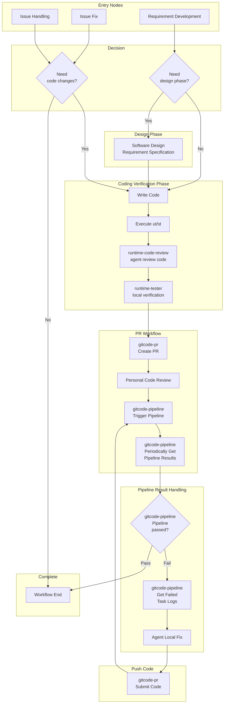

# Runtime Repository Agent Skills Planning

## Runtime Repository Skills List

> **Note**: In the list, `[x]` indicates that the skill is ready, and `[ ]` indicates that the skill is still in planning and has not been implemented yet.

- [x] **gitcode-issue** — Read Issue details, read and reply to comments. Trigger command: `Read issue 168 and submit pr to fix`
- [x] **gitcode-pr** — Create PR, cherry-pick code to commercial branches. Trigger command: `Review pr 1437` or `Create pr to develop branch`
- [ ] **superpowers** — Requirement development (generate software design documents, coding, generate test cases). Trigger command: `Develop requirement, requirements...`
- [x] **runtime-code-review** — Review local code and GitCode PR following various coding standards and module software design constraints
- [x] **runtime-errmsg-rectification** — Runtime Error Message rectification: review error codes, reporting macros, error messages, and reporting boundaries. Trigger command: `Perform Error Message rectification` or `Review Error Message reporting correctness`
- [x] **errmsg-ut-setup** — Set up an ErrMsg real-reporting UT verification framework, allowing `ErrorManager::ATCReportErrMessage` to call the real implementation and print formatted ErrMsg. Trigger command: `Verify ErrMsg reporting rectification result` or `Run ErrMsg UT verification`
- [ ] **gitcode-pipeline** — Trigger pipeline tasks, query pipeline status, get failed task logs
- [ ] **runtime-dt-runner** — Compile and execute UT/ST test cases
- [ ] **runtime-tester** — Generate test cases, execute test cases in environments with NPU
- [ ] **api-doc-generator** — Generate documentation for external APIs
- [ ] **install-cann-toolkit** — Download latest CANN toolkit package and install

## Agent Supported Workflows

- Requirement development: Complete the entire workflow from software design to coding and verification. Use gitcode-pr to submit PR, personally review code, use gitcode-pipeline to trigger pipeline, and periodically get results. If the pipeline fails, you can get the corresponding failed task logs, locally modify code, and resubmit PR to monitor the pipeline.
- Issue fix: Modify code, and the subsequent PR submission workflow is the same as above.
- Resolve issue: Use gitcode-issue to read issue and comments. If code or document modifications are involved, the workflow is the same as above.
- Execute test cases or samples: Use runtime-test to execute test cases in real environments

## Runtime Repository Skills Path

- Project team shared, hoping to achieve default installation or update when starting agent
- Skills only used in runtime repository can be directly submitted to the runtime repository `.claude/skills` directory
- Skills shared across multiple repositories have source code in a public repository (currently https://gitcode.com/cann-agent/skills). When starting agent, skills will be automatically downloaded or updated to the `.claude/skills` directory

> **Note**: Cross-repository shared skills like `gitcode-issue` and `gitcode-pr` are not maintained in the Runtime repository's `.claude/skills` directory. Their source code is stored in a public repository. When starting an agent in the runtime directory, they will be automatically downloaded and installed to the local `.claude/skills` directory.

## Agent Auxiliary Workflow
