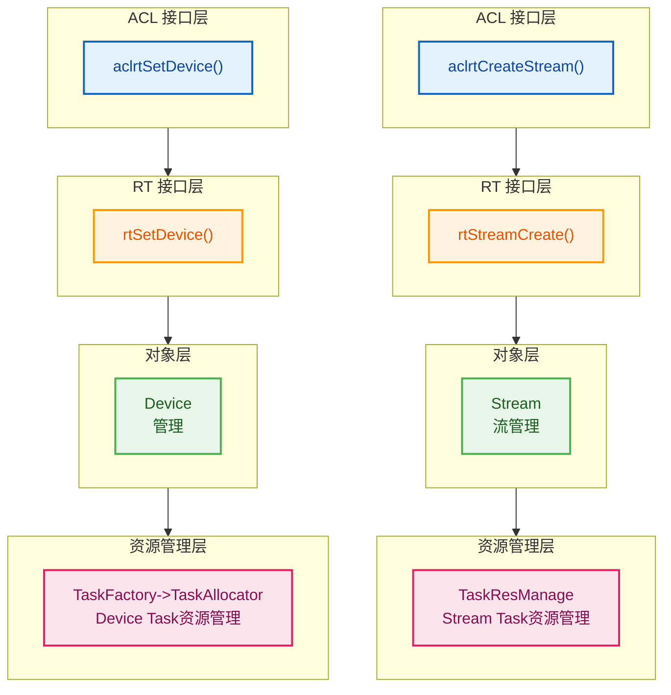
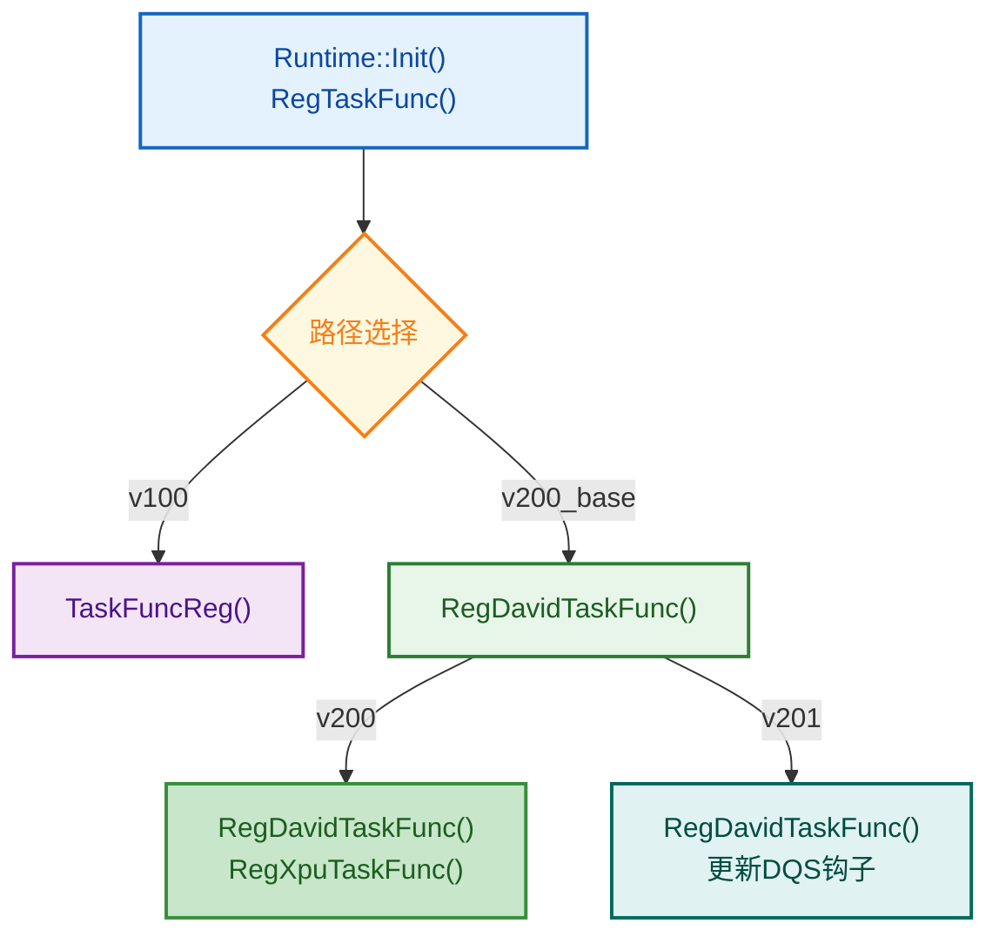
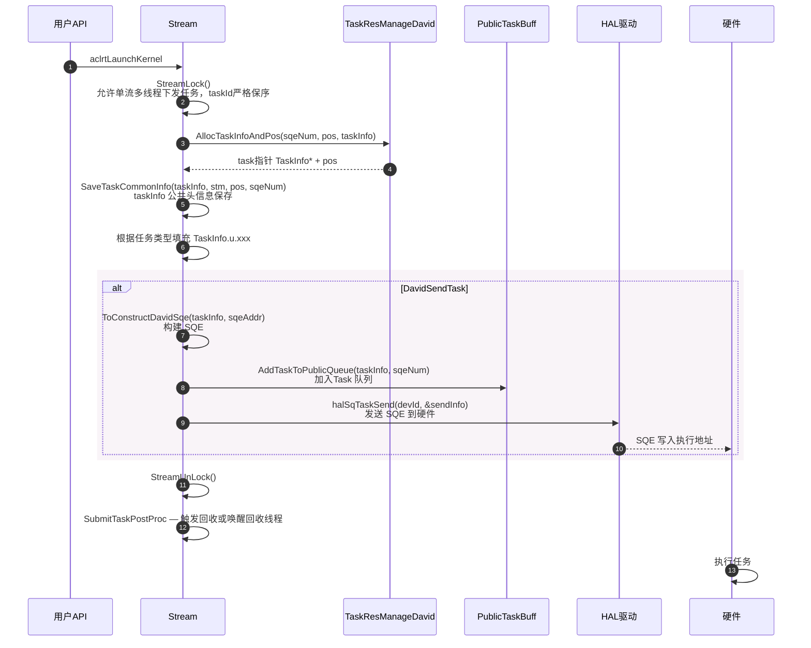
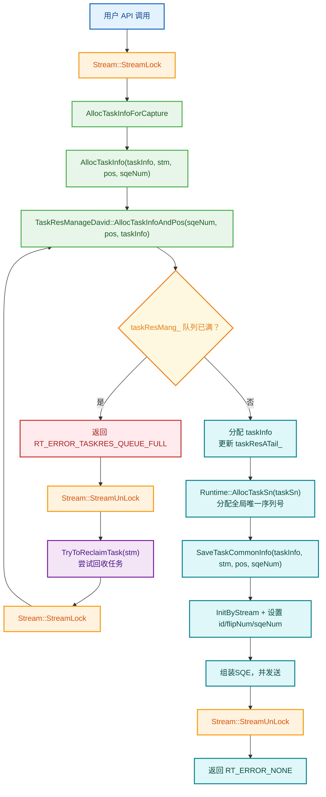
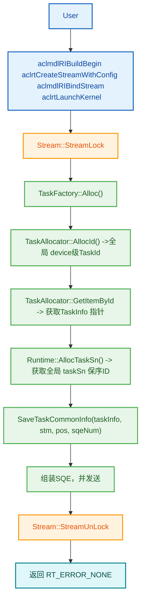
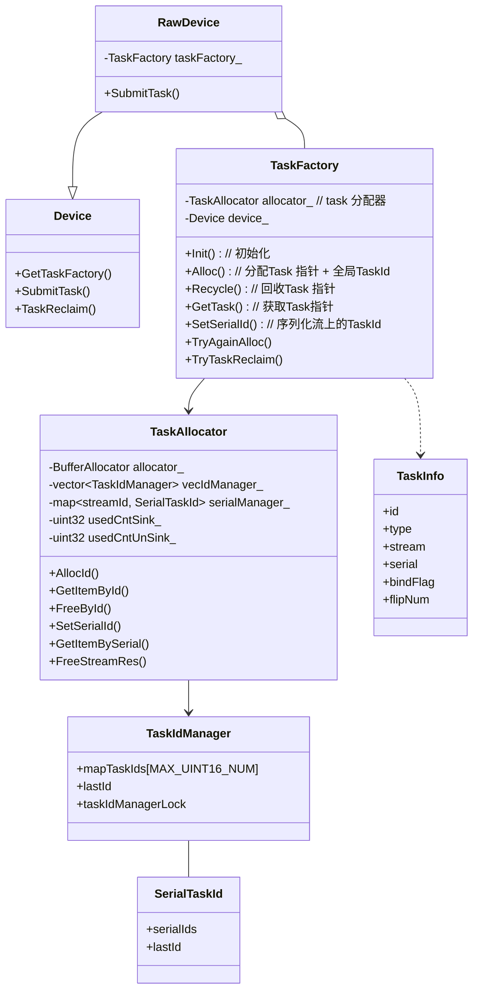
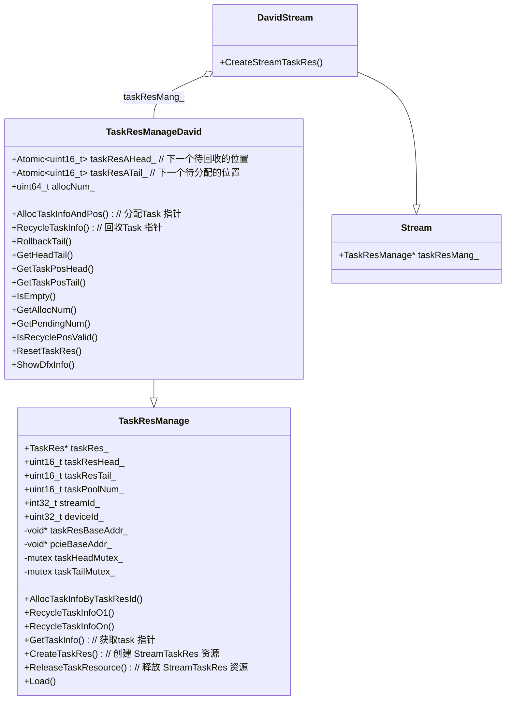

# Task 模块架构

## 1. 模块概述

- **功能介绍**：Task 模块负责管理各类任务的创建、执行和回收。支持多种任务类型（核函数执行、内存操作、事件同步、模型执行等），通过 TaskInfo 结构体承载任务信息。Stream::taskResMang_ 和 TaskFatory 共同负责任务对象分配和回收。
- **设计目标**：
  - 提供统一的任务管理接口
  - 支持多种任务类型扩展
  - 实现高效的任务分配和回收机制
  - 支持任务状态管理和错误处理

## 2. 使用场景与对外接口

### 2.1 使用场景示意

- **场景一**：内核执行任务
  ```cpp
    // 下发单算子任务
    aclrtLaunchKernel(funcHandle, numBlocks, argsData, argsSize, stream);
    aclrtLaunchKernelXXX();
  ```

- **场景二**：事件同步任务
  ```cpp
  // 下发event 同步任务，并流同步结果
  aclrtRecordEvent(event, stream1);  // 在 stream1 记录事件
  aclrtStreamWaitEvent(stream2, event);  // stream2 等待事件
  aclrtSynchronizeStream(stream1);  // stream1 流同步，触发回收
  aclrtSynchronizeStream(stream2);  // stream2 流同步，触发回收
  ```

### 2.2 任务类型
| 任务分类 | 任务类型 | 头文件 | 说明 |
|---------|---------|--------|------|
| 计算类任务 | `TS_TASK_TYPE_KERNEL_AICORE` <br> `TS_TASK_TYPE_KERNEL_AICPU` <br> `TS_TASK_TYPE_KERNEL_AIVEC` | `davinci_kernel_task.h` | 算子核执行 |
| 内存类任务 | `TS_TASK_TYPE_MEMCPY` | `memory_task.h` | H2D、D2D、D2H等异步拷贝任务执行 |
| 事件同步类任务 | `TS_TASK_TYPE_EVENT_RECORD` <br> `TS_TASK_TYPE_STREAM_WAIT_EVENT` <br> `TS_TASK_TYPE_NOTIFY_RECORD` <br> `TS_TASK_TYPE_NOTIFY_WAIT` <br> `TS_TASK_TYPE_DAVID_EVENT_*` <br> `TS_TASK_TYPE_MEM_WRITE/WAIT_VALUE` | `event_task.h` <br> `notify_task.h` <br> `common_task.h` |流间同步、卡间同步等事件等待执行|
| 条件类任务 | `TS_TASK_TYPE_LABEL_*` <br> `TS_TASK_TYPE_STREAM_SWITCH` <br> `TS_TASK_TYPE_STREAM_ACTIVE` | `cond_op_label_task.h` | 标签控制类 |
| 管理类任务 | `TS_TASK_TYPE_MAINTENANCE` <br> `TS_TASK_TYPE_MODEL_MAINTAINCE` <br> `TS_TASK_TYPE_MODEL_EXECUTE`| `maintenance_task.h` <br>  `model_maintaince_task.h` <br> `model_execute_task.h` | 维护操作（流/事件销毁） <br> 模型绑定/解绑流 <br> 模型执行 |

## 3. 架构总览

**整体设计思路**
**Task 管理整理分为三部分：**
- **Task 资源管理：** Task 资源分为两部分，Device 粒度的Task资源和Stream粒度的资源。
- **Task 处理函数：** Task 处理函数主要是针对不同类型的Task进行任务初始化、SQE封装、Task回收后处理、Task 异常后处理等流程进行统一注册管理。
- **Task 下发流程：** 配合API接口通过task资源申请、任务组装、任务下发的等接口组合完成运行时调度。


### 3.1 Task 资源管理架构



### 3.2 Task 处理函数注册架构



### 3.3 David Task下发流程



## 4. 详细设计

### 4.1 核心流程

#### 4.1.1 单算子流上 Task 资源申请和下发流程



#### 4.1.2 模型流 Task 资源申请和下发流程



### 4.2 核心机制详解

#### 4.2.1 TaskInfo 结构设计

**设计思想**：TaskInfo 作为任务的统一载体，包含任务类型、参数、状态、位域标记等信息。通过 union 存储不同任务类型的专用信息结构。

```cpp
// 文件位置：core/inc/task/task_info.hpp
typedef struct tagTaskInfoStru {
    Stream *stream;              // 所属流
    tsTaskType_t type;           // 任务类型枚举
    uint32_t errorCode;          // 错误码
    uint32_t taskSn;             // 流水号（profiling 用）
    uint32_t pos;                // SQ 位置（David 用）
    uint16_t id;                 // 任务 ID
    uint16_t flipNum;            // 翻转计数（taskId 回卷）
    uint8_t profEn;              // Profiling 启用标志
    ...
    uint8_t serial : 1;          // 串行 ID 模式
    uint8_t bindFlag : 1;        // 模型绑定流标志
    uint8_t isCqeNeedConcern : 1; // CQE 需关注
    uint8_t isNeedStreamSync : 1; // 需流同步
    uint8_t sqeNum : 7;           // SQE 数量（David 多 SQE）
    ...
    union {
        AicTaskInfo aicTaskInfo;
        AicpuTaskInfo aicpuTaskInfo;
        DavinciMultiTaskInfo davinciMultiTaskInfo;
        MemcpyAsyncTaskInfo memcpyAsyncTaskInfo;
        ...
    } u;   // 各任务类型专用信息
    ...
} TaskInfo;
```

#### 4.2.2 TaskRes资源分配核心逻辑

**TaskResManageDavid 核心分配代码**：Stream上的TaskId需要严格保序，从TaskInfo指针申请到sqe组组装下发到硬件，整个过程要和TaskId行为一致。因此整个过程有StreamLock进行控制。

**多 SQE 设计**：一个任务可能占用多个 SQE（如 `sqeNum=2`）， `taskInfo.id` 都指向首位置 `pos`。回收时按 `sqeNum` 刷新 `taskResAHead_`。

```cpp
// task_res_da.cc
rtError_t TaskResManageDavid::AllocTaskInfoAndPos(uint32_t sqeNum, uint32_t &pos, TaskInfo **task, bool needLog) {
    const uint16_t head = taskResAHead_.Value();
    uint16_t tail = taskResATail_.Value();
    const uint32_t taskDesTailIdx = (tail + sqeNum) % taskPoolNum_;
    
    // 满判断：考虑环形队列翻转
    if (((tail < head) && ((tail + sqeNum) >= head)) ||
        ((tail > head) && ((tail + sqeNum) >= taskPoolNum_) && (taskDesTailIdx >= head))) {
        return RT_ERROR_TASKRES_QUEUE_FULL;
    }
    
    pos = tail;
    *task = &taskRes_[pos].taskInfo;
    (void)memset_s(*task, sizeof(TaskInfo), 0, sizeof(TaskInfo));
    
    // 多 SQE 任务：所有 sqeNum 共享同一个 id（= pos）
    while (tail != taskDesTailIdx) {
        taskRes_[tail].taskInfo.id = pos;
        tail = (tail + 1U) % taskPoolNum_;
    }
    
    taskResATail_.Set(tail);   // 更新 tail
    allocNum_++;                // 累计分配计数（用于周期回收触发）
    return RT_ERROR_NONE;
}
```

**队列满时的回收重试**：

```cpp
// task_david.cc
rtError_t AllocTaskInfo(TaskInfo **taskInfo, Stream *stm, uint32_t &pos, uint32_t sqeNum) {
    TaskResManageDavid *taskResMang = ...;
    rtError_t error = taskResMang->AllocTaskInfoAndPos(sqeNum, pos, taskInfo);
    
    while (error == RT_ERROR_TASKRES_QUEUE_FULL) {
        // 释放 StreamLock，尝试回收
        stm->StreamUnLock();
        TryToReclaimTask(stm, needLog);  // 调用 TaskReclaimByStream 或唤醒回收线程
        stm->StreamLock();
        // 重试分配
        error = taskResMang->AllocTaskInfoAndPos(sqeNum, pos, taskInfo, needLog);
    }
    if (error == RT_ERROR_NONE) {
        Runtime::Instance()->AllocTaskSn((*taskInfo)->taskSn);
    }
    return error;
}
```

#### 4.2.3 Task处理函数的回调框架

**1. TaskFuncSingle 结构体** <br/>
不同 TASK_TYPE 的任务回调函数结构体，针对不同 CHIP_TYPE 和 taskType 单独处理，调用函数 rtError_t RegTaskFunc(rtChipType_t chipType, tsTaskType_t taskType, const TaskFuncSingle& funcs) 进行全局注册。

```cpp
// task_manager.h:61-70
struct TaskFuncSingle {
    PfnTaskToCmd toCommandFunc;
    PfnTaskToSqe toSqeFunc;
    PfnDoCompleteSucc doCompleteSuccFunc;
    PfnTaskUnInit taskUnInitFunc;
    PfnWaitAsyncCpCompleteFunc waitAsyncCpCompleteFunc;
    PfnPrintErrorInfo printErrorInfoFunc;
    PfnTaskSetResult setResultFunc;
    PfnTaskSetStarsResult setStarsResultFunc;
};
```

**2. TaskFuncArrays 结构体** <br/>
TaskFuncArrays g_taskFuncArrays[CHIP_END]  runtime初始化的时候根据 CHIP_TYPE 保存对应 TaskFunc。

```cpp
// task_manager.h
struct TaskFuncArrays {
    PfnTaskToCmd toCommandFunc[TS_TASK_TYPE_RESERVED];           // [0] TaskCommand 构建
    PfnTaskToSqe toSqeFunc[TS_TASK_TYPE_RESERVED];               // [1] SQE 构建
    PfnDoCompleteSucc doCompleteSuccFunc[TS_TASK_TYPE_RESERVED];  // [2] Task完成后处理
    PfnTaskUnInit taskUnInitFunc[TS_TASK_TYPE_RESERVED];          // [3] Task指针清空
    PfnWaitAsyncCpCompleteFunc waitAsyncCpCompleteFunc[TS_TASK_TYPE_RESERVED]; // [4] 异步等待
    PfnPrintErrorInfo printErrorInfoFunc[TS_TASK_TYPE_RESERVED];  // [5] 错误打印
    PfnTaskSetResult setResultFunc[TS_TASK_TYPE_RESERVED];        // [6] Task异常结果设置（v100）
    PfnTaskSetStarsResult setStarsResultFunc[TS_TASK_TYPE_RESERVED]; // [7] Task异常结果设置（v100）
};
```
**3. Task处理时使用的全局变量**  <br/>
业务代码中通过 g_XXX 对 taskType 进行回调处理。
```cpp
static PfnTaskToCmd *g_toCommandFunc = g_taskFuncArrays[CHIP_BEGIN].toCommandFunc;
static PfnTaskToSqe *g_toSqeFunc = g_taskFuncArrays[CHIP_BEGIN].toSqeFunc;
static PfnDoCompleteSucc *g_doCompleteSuccFunc = g_taskFuncArrays[CHIP_BEGIN].doCompleteSuccFunc;
static PfnWaitAsyncCpCompleteFunc *g_waitAsyncCpCompleteFunc = g_taskFuncArrays[CHIP_BEGIN].waitAsyncCpCompleteFunc;
static PfnPrintErrorInfo *g_printErrorInfoFunc = g_taskFuncArrays[CHIP_BEGIN].printErrorInfoFunc;
static PfnTaskSetResult *g_setResultFunc = g_taskFuncArrays[CHIP_BEGIN].setResultFunc;
static PfnTaskSetStarsResult *g_setStarsResultFunc = g_taskFuncArrays[CHIP_BEGIN].setStarsResultFunc;
PfnTaskUnInit *g_taskUnInitFunc = g_taskFuncArrays[CHIP_BEGIN].taskUnInitFunc;

```

### 4.2.4 任务回收流程
#### 4.2.4.1 David 任务回收触发时机

| 触发条件 | 调用方式 | 说明 |
|----------|---------|------|
| 每 64 个任务下发后 | `WakeUpRecycleThread` | 周期性回收，`allocNum_ % 64 == 0` 时触发 |
| 下发任务队列满 | `TryToReclaimTask` | 分配队列满时触发主动回收 |
| 流同步（Synchronize） | `WakeUpRecycleThread` | 出发回收线程，等待所有任务完成 |
| 流销毁（TearDown） | `TaskReclaimByStream` | 清空所有任务 |
| 独立回收线程 | `RecycleThreadDoForStarsV2` | `IsSeparateSendAndRecycle()` 模式 |

#### 4.2.4.2 独立回收线程

```cpp
// task_recycle.cc:310-341
void RecycleThreadDoForStarsV2(Device *deviceInfo) {
    // 遍历设备上所有 stream
    for (const auto &id : streamIdList) {
        stream->StreamRecycleLock();
        stream->ProcArgRecycleList();     // 处理 arg 回收列表
        
        // 跳过空队列 / DVPP 绑定 / 非独立回收模式
        if (taskResMang->IsEmpty() || stream->IsBindDvppGrp() || !stream->IsSeparateSendAndRecycle()) {
            continue;
        }
        
        TaskReclaimForSeparatedStm(stream);
        //   → ProcLogicCqUntilEmpty(stm)  // 先收 CQE
        //   → RecycleTaskBySqHeadForRecyleThread(stm)  // 再根据 drv sqHead 回收
        
        stream->StreamRecycleUnlock();
    }
}
```

### 4.3 模块职责划分
 | 模块 | 职责 | 位置 | 
 |------|------|------| 
 | TaskInfo | 任务信息结构体 | `task/inc/task_info.h` | 
 | TaskFactory | 任务对象工厂类 Device对象持有，Task 对象分配和回收 | `task/task_factory.hpp` | 
 | TaskAllocator | 任务对象分配器，管理任务池，属于TaskFactory | `task/task_allocator.hpp` | 
 | TaskResManage | 任务资源管理，Stream持有 | `task/task_res_manage/` | 
 | DavidSendTask <br/> SubmitTask | 任务提交模块 | `task/task_submit/v200/task_david.cc` <br/> `engine/engine.cc`|
 | RecycleThreadDoForStarsV2 | 任务回收模块 | `task/task_recycle/` <br/> `stars_engine.cc`| 

### 4.4 核心数据结构

#### 4.4.1 Device TaskFactory 类图



#### 4.4.2 Stream TaskRes 类图



## 5. 关键文件索引

| 功能模块 | 文件路径 | 核心内容 |
|----------|---------|---------|
| Stream 声明 | `core/src/stream/stream.hpp` | `taskResMang_` 字段 |
| DavidStream | `core/src/stream/stream_david.cc` | CreateStreamTaskRes<br>TearDown |
| TaskInfo 定义 | `core/inc/task/task_info.hpp` | TaskInfo 结构体 |
| TaskRes 基类 | `core/inc/task/task_res.hpp` | TaskRes 结构 <br> TaskResManage 类声明 |
| TaskResManageDavid | `core/inc/task/task_res_da.hpp` | 原子 head/tail<br> AllocTaskInfoAndPos |
| TaskResManage 实现 | `core/src/task/task_res_manage/task_res.cc` | v100 分配/回收/Load |
| TaskResManageDavid 实现 | `core/src/task/task_res_manage/v200/task_res_da.cc` | David 分配/回收/回滚 |
| David 任务下发 | `core/src/task/task_submit/v200/task_david.cc` | AllocTaskInfo <br> DavidSendTask |
| David 任务回收 | `core/src/task/task_recycle/v200/task_recycle.cc` | TryRecycleTask <br> 回收线程 |
| 回收公共逻辑 | `core/src/task/task_recycle/v200/task_recycle_common_base.cc` | TaskReclaimForSeparatedStm <br> 回收CQE、回收Task |
---

_本模块文档基于源码 `src/runtime/core/src/task/` 分析。_