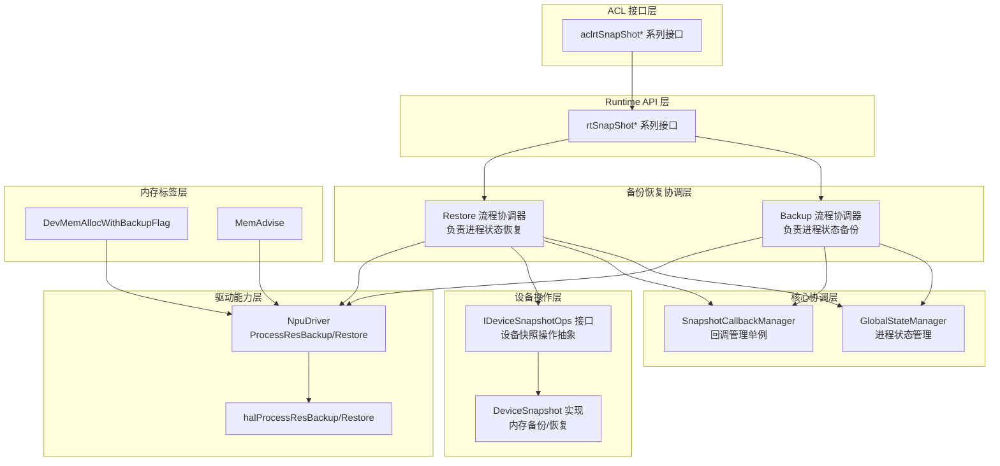
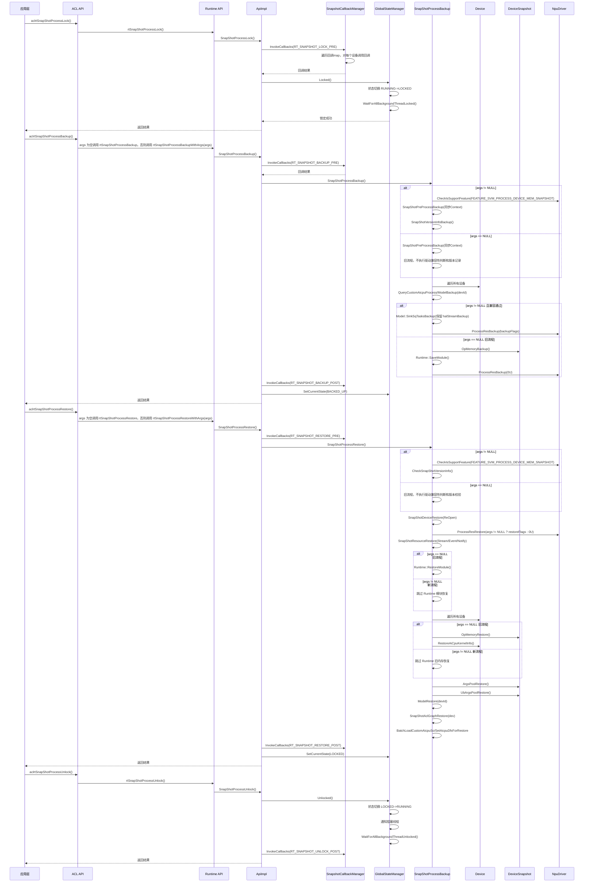
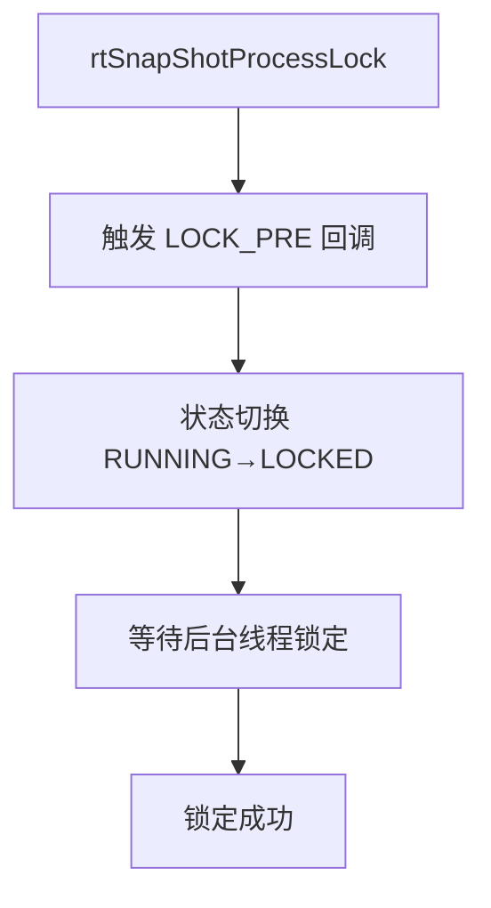
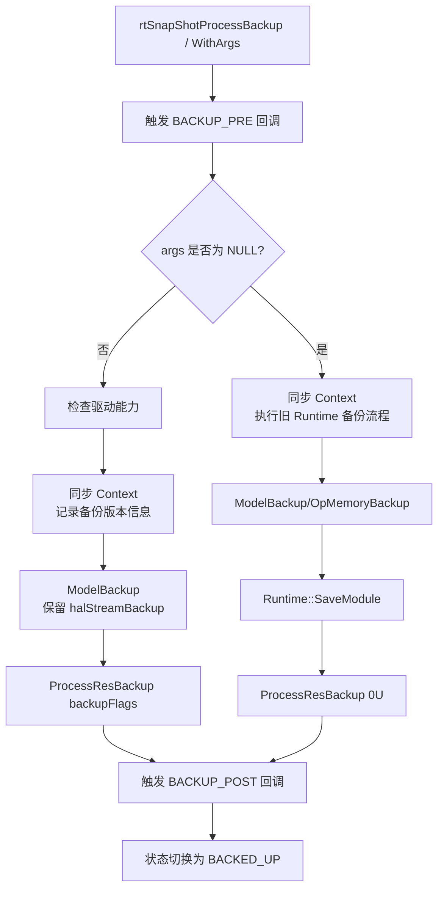
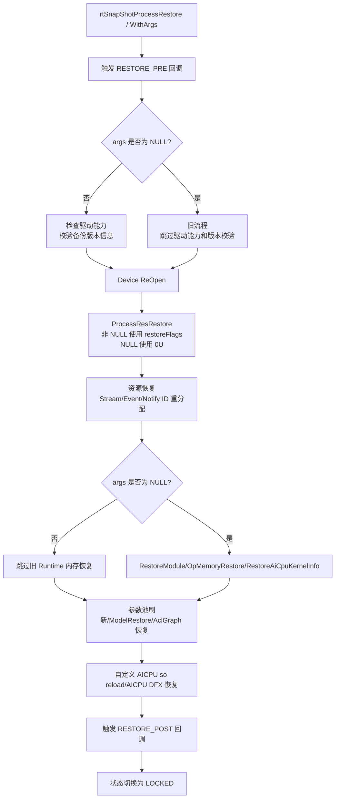
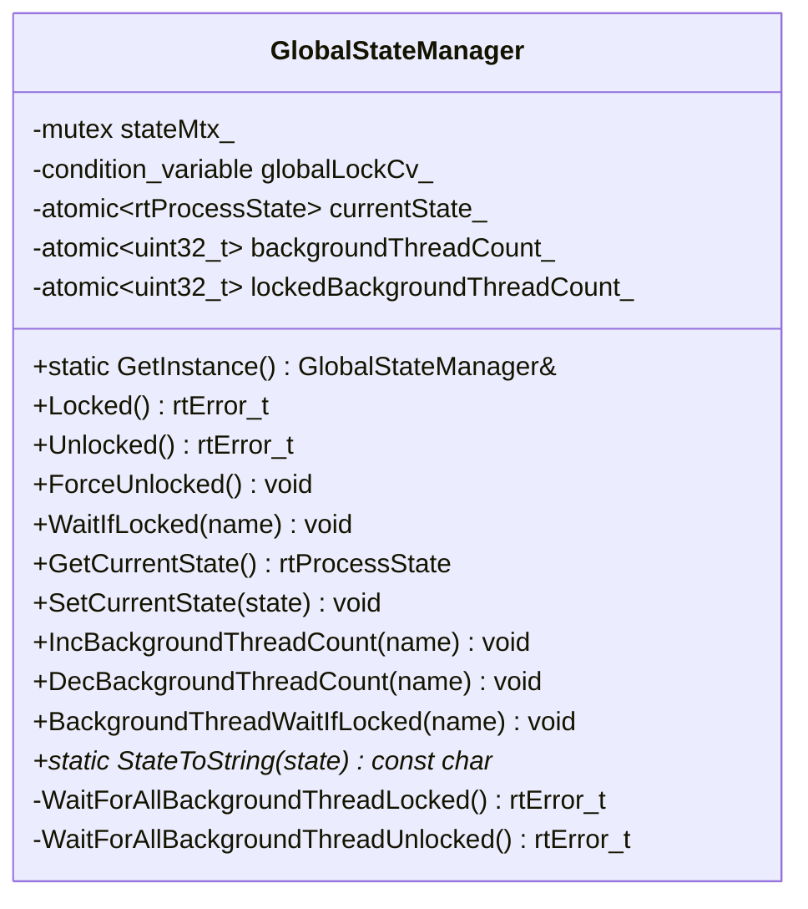
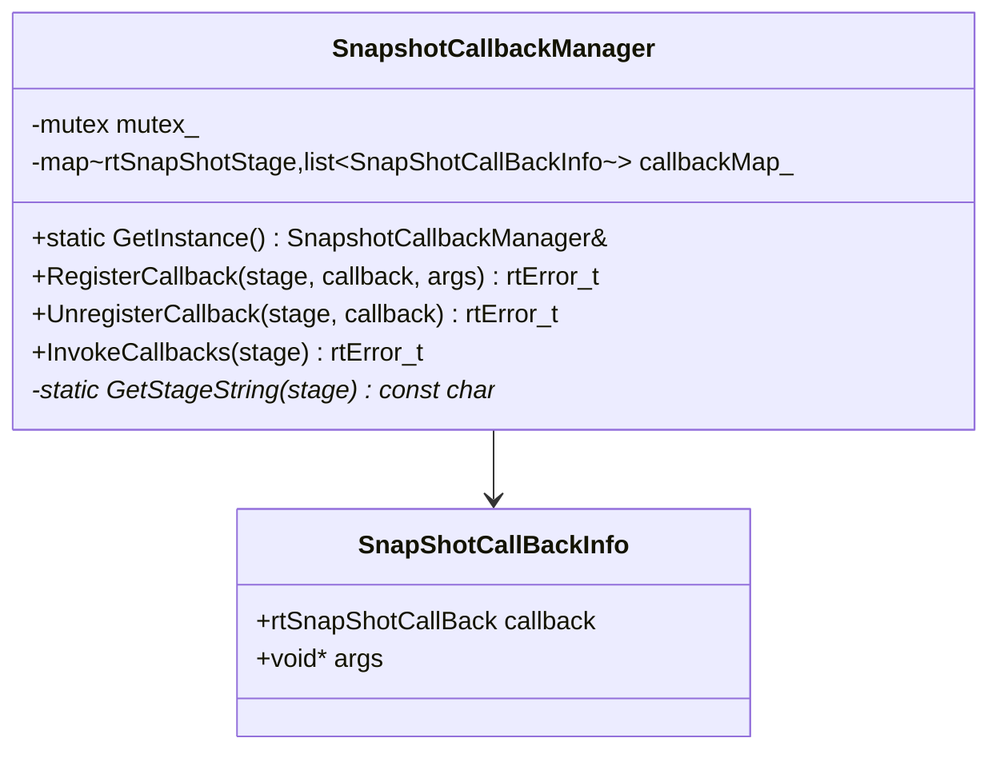
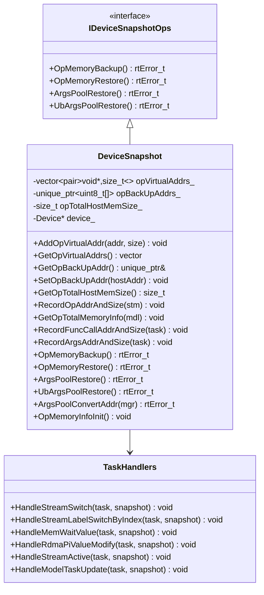
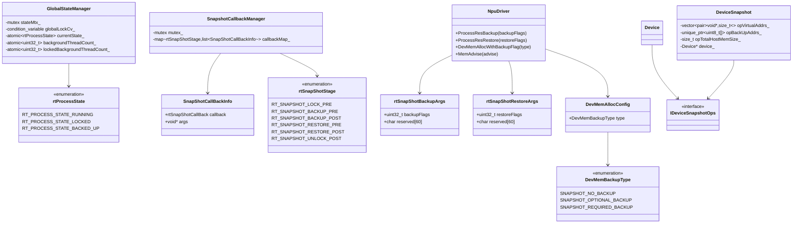
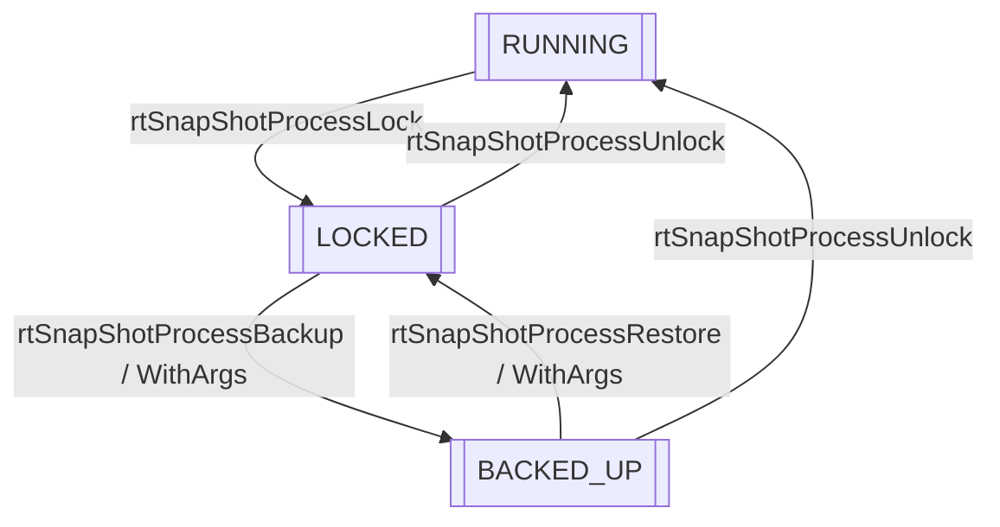

# Snapshot 特性

## 1. 特性概述

- **特性介绍**：Snapshot 特性支持 NPU 进程状态保存和恢复，用于进程级快照备份/恢复场景（故障恢复）。通过锁定进程、备份关键状态、恢复资源，实现进程状态的完整保存和恢复。
- **问题背景**：进程在运行过程中需要保存完整状态以便后续恢复。大规模AI集群的故障恢复效率直接影响训练任务的可用性与资源利用率。传统故障恢复链路涉及容器调度、进程重建、主机与设备建链、算子编译、权重加载等多个串行环节，单次恢复耗时可达十余分钟。
- **设计目标**：
  - 支持进程锁定/解锁控制
  - 支持进程状态备份
  - 支持进程状态恢复
  - 支持基于驱动能力的备份/恢复流程切换
  - 支持 Runtime 内部设备内存按 required/optional/no_backup 标签参与快照
  - 提供多阶段回调机制

## 2. 使用场景与对外接口

### 2.1 使用场景

- **场景一**：进程快照备份
  ```cpp
  // 1. 锁定进程
  aclError ret = aclrtSnapShotProcessLock(pid, nullptr);
  // 2. 备份进程状态
  aclrtSnapShotBackupArgs backupArgs = {};
  backupArgs.backupFlags = 0U;
  ret = aclrtSnapShotProcessBackup(pid, &backupArgs);
  // 3. 在目标端恢复进程状态
  aclrtSnapShotRestoreArgs restoreArgs = {};
  restoreArgs.restoreFlags = 0U;
  ret = aclrtSnapShotProcessRestore(pid, &restoreArgs);
  // 4. 解锁进程
  ret = aclrtSnapShotProcessUnlock(pid, nullptr);
  ```

- **场景二**：注册回调快照阶段
  ```cpp
  // 注册备份前回调
  aclrtSnapShotCallBack callback = MyBackupPreCallback;
  aclrtSnapShotCallbackRegister(ACL_RT_SNAPSHOT_BACKUP_PRE, callback, nullptr);
  // 注册恢复后回调
  aclrtSnapShotCallbackRegister(ACL_RT_SNAPSHOT_RESTORE_POST, MyRestorePostCallback, nullptr);
  ```

### 2.2 对外接口

| 接口 | 文件位置 | 说明 |
|------|----------|------|
| `aclrtSnapShotProcessLock()` | `include/external/acl/acl_rt.h` | 锁定进程 |
| `aclrtSnapShotProcessUnlock()` | `include/external/acl/acl_rt.h` | 解锁进程 |
| `aclrtSnapShotProcessBackup()` | `include/external/acl/acl_rt.h` | 备份进程状态 |
| `aclrtSnapShotProcessRestore()` | `include/external/acl/acl_rt.h` | 从备份点恢复进程 |
| `aclrtSnapShotCallbackRegister()` | `include/external/acl/acl_rt.h` | 注册快照阶段回调 |
| `aclrtSnapShotCallbackUnregister()` | `include/external/acl/acl_rt.h` | 注销快照阶段回调 |

### 2.3 快照阶段定义

```cpp
// 文件位置：include/external/acl/acl_rt.h
typedef enum {
    ACL_RT_SNAPSHOT_LOCK_PRE = 0,
    ACL_RT_SNAPSHOT_BACKUP_PRE,
    ACL_RT_SNAPSHOT_BACKUP_POST,
    ACL_RT_SNAPSHOT_RESTORE_PRE,
    ACL_RT_SNAPSHOT_RESTORE_POST,
    ACL_RT_SNAPSHOT_UNLOCK_POST,
} aclrtSnapShotStage;
```

### 2.4 备份/恢复参数

`aclrtSnapShotBackupArgs.backupFlags` 和 `aclrtSnapShotRestoreArgs.restoreFlags` 用于控制驱动备份/恢复范围：

| 取值 | 含义 |
|------|------|
| `0U` | 仅处理 required 级别的快照内存。 |
| `1U` | 处理 required 与 optional 级别的快照内存。 |

ACL 层在 `args` 非 `NULL` 时会校验参数：`backupFlags` / `restoreFlags` 只能为 `0U` 或 `1U`；校验不通过直接返回参数非法。

`reserved` 为冗余保留字段，当前备份/恢复流程不使用该字段。

当 `args` 传入 `NULL` 时，Runtime 兼容旧接口语义，直接执行旧 Runtime 备份/恢复流程，`backupFlags` / `restoreFlags` 不参与判断。当 `args` 传入非 `NULL` 时，Runtime 会检查驱动是否支持进程级设备内存快照；支持时按 flags 控制驱动备份/恢复范围，不支持时直接返回不支持，不回退旧 Runtime 流程。

## 3. 架构总览

### 整体设计思路

Snapshot 特性采用分层架构设计：
- **ACL 接口层**：提供 C 语言接口（aclrtSnapShot* 系列）
- **Runtime API 层**：ACL 参数为空时调用旧无参 `rtSnapShotProcessBackup` / `rtSnapShotProcessRestore` 保持旧流程兼容语义；ACL 参数非空时通过 `rtSnapShotProcessBackupWithArgs` / `rtSnapShotProcessRestoreWithArgs` 承接并贯通 `backupFlags` / `restoreFlags`
- **核心协调层**：GlobalStateManager 管理进程状态和版本信息，SnapshotCallbackManager 管理回调
- **备份恢复协调层**：命名空间级别函数实现备份恢复流程协调
- **设备操作层**：DeviceSnapshot 实现旧 Runtime 内存备份/恢复，并承担参数池地址刷新
- **驱动能力层**：NpuDriver 调用 `halProcessResBackup` / `halProcessResRestore` 执行进程级设备内存快照
- **内存标签层**：设备内存申请或 `MemAdvise` 时写入 required/optional/no_backup 标签，供驱动按 flags 选择备份范围

### 架构分层图



### 核心模块交互图



## 4. 详细设计

### 4.1 核心流程

#### 进程锁定流程



**功能说明**：
- **回调触发**：触发 LOCK_PRE 阶段回调，允许上层执行准备工作
- **状态切换**：GlobalStateManager 将进程状态从 RUNNING 切换为 LOCKED
- **线程同步**：等待所有注册的后台线程进入阻塞状态，确保状态一致性
- **错误处理**：若当前状态非 RUNNING 或等待超时，则返回错误码

关键文件位置：`src/runtime/api/impl/api_impl_snapshot.cc`

#### 进程备份流程



**功能说明**：
- **预处理阶段**：触发 BACKUP_PRE 回调；`args` 非 `NULL` 时先检查驱动能力，检查通过后再同步所有 Context，确保没有任务在执行
- **非NULL参数流程**：检查驱动是否支持 `FEATURE_SVM_PROCESS_DEVICE_MEM_SNAPSHOT`，不支持则直接返回不支持；支持后同步 Context 并记录版本信息，跳过旧 Runtime 内存备份，由 `NpuDriver::ProcessResBackup(backupFlags)` 交给驱动处理
- **NULL参数流程**：兼容旧接口语义，不执行驱动能力判断和版本记录，执行 `OpMemoryBackup`、`Runtime::SaveModule` 等旧 Runtime 备份逻辑，并向驱动传入 `0U`
- **后处理阶段**：触发 BACKUP_POST 回调，将进程状态切换为 BACKED_UP

关键文件位置：
- `src/runtime/api/impl/api_impl_snapshot.cc`
- `src/runtime/feature/snapshot/snapshot_process_helper.cc`

#### 进程恢复流程



**功能说明**：
- **预处理阶段**：触发 RESTORE_PRE 回调，准备恢复环境
- **非NULL参数流程**：先检查驱动是否支持 `FEATURE_SVM_PROCESS_DEVICE_MEM_SNAPSHOT`，不支持则直接返回不支持；支持后校验备份时记录的 Runtime/Driver API 版本，版本不一致时恢复失败
- **NULL参数流程**：兼容旧接口语义，不执行驱动能力判断和版本一致性校验，执行旧 Runtime 恢复流程
- **设备恢复阶段**：重新打开所有设备，并调用驱动恢复进程资源
- **资源恢复阶段**：清理并重新分配 Stream ID、Event ID、Notify ID
- **非NULL参数新流程**：跳过 `RestoreModule`、`OpMemoryRestore`、`RestoreAiCpuKernelInfo` 等旧 Runtime 内存恢复，避免与驱动恢复重复
- **NULL参数旧流程**：保留旧 Runtime 内存恢复逻辑
- **保留流程**：参数池地址刷新、`ModelRestore`、ACL Graph 恢复、自定义 AICPU so reload、AICPU DFX 恢复继续执行；`halStreamRestore` 在 `ModelRestore` 中保留
- **后处理阶段**：触发 RESTORE_POST 回调，将进程状态切换为 LOCKED

关键文件位置：
- `src/runtime/api/impl/api_impl_snapshot.cc`
- `src/runtime/feature/snapshot/snapshot_process_helper.cc`

#### 兼容性与内存标签策略

Snapshot 通过 `args` 是否为空选择新旧流程；仅 `args` 非空时进行驱动 feature 判断：

| 条件 | 备份行为 | 恢复行为 |
|------|----------|----------|
| `args == NULL` | 兼容旧接口语义，不进行 `FEATURE_SVM_PROCESS_DEVICE_MEM_SNAPSHOT` 判断，执行旧 Runtime 备份流程。 | 兼容旧接口语义，不进行 `FEATURE_SVM_PROCESS_DEVICE_MEM_SNAPSHOT` 判断，也不执行备份/恢复版本一致性校验，执行旧 Runtime 恢复流程。 |
| `args != NULL` 且支持 `FEATURE_SVM_PROCESS_DEVICE_MEM_SNAPSHOT` | 底层驱动根据传入的 `backupFlags` 和设备内存标签执行备份。`backupFlags` 为 `1U` 时备份 optional 和 required 标签内存，为 `0U` 时只备份 required 标签内存。 | 先校验备份/恢复版本一致性；校验通过后，底层驱动根据传入的 `restoreFlags` 和设备内存标签执行恢复。`restoreFlags` 为 `1U` 时恢复 optional 和 required 标签内存，为 `0U` 时只恢复 required 标签内存。 |
| `args != NULL` 且不支持 `FEATURE_SVM_PROCESS_DEVICE_MEM_SNAPSHOT` | 当前驱动版本不具备进程级设备内存备份能力，直接返回不支持，不回退旧 Runtime 备份流程。 | 当前驱动版本不具备进程级设备内存恢复能力，直接返回不支持，不回退旧 Runtime 恢复流程。 |

`args` 非空且兼容性通过时，驱动侧按设备内存标签和 `backupFlags` / `restoreFlags` 决定备份/恢复范围；`args` 为空时，备份与恢复逻辑由旧 Runtime 流程完成，此时标签不参与旧流程判断，标签本身无实际意义。Runtime 内部采用以下标签原则：

| 标签 | 使用原则 |
|------|----------|
| `SNAPSHOT_REQUIRED_BACKUP` | 兼容性通过时，无论 `backupFlags` / `restoreFlags` 为 `0U` 还是 `1U`，驱动都必须备份/恢复的内存。适用于恢复后必须保持内容一致的 Runtime 内部设备内存。 |
| `SNAPSHOT_OPTIONAL_BACKUP` | 兼容性通过且 `backupFlags` / `restoreFlags` 为 `1U` 时，才由驱动备份/恢复的内存。适用于非必须备份，或恢复阶段可重新构建/重新下发的 Runtime 辅助内存。 |
| `SNAPSHOT_NO_BACKUP` | 兼容性通过时也不需要驱动备份/恢复的内存。适用于恢复过程中的临时设备 buffer，用完即释放，不参与 Snapshot 备份恢复。 |

`DevMemAllocWithBackupFlag` 是 Runtime 内部申请设备内存时写入快照标签的统一入口，默认标签为 `SNAPSHOT_REQUIRED_BACKUP`；optional/no_backup 场景显式传参。底层通过 `FlagAddBackupBit` 将 Runtime 标签转换为驱动侧 `MEM_SNAPSHOT_REQUIRED` / `MEM_SNAPSHOT_OPTIONAL` 标志位。对于不能在申请点传入标签、但兼容性通过时应由驱动按 required 处理的设备地址，由内部实现调用 `NpuDriver::MemAdvise(..., ADVISE_SNAPSHOT_REQUIRED, ...)` 补充 required 标记。

### 4.2 核心组件详解

#### GlobalStateManager 进程状态管理

**设计思想**：管理进程全局状态，控制 API 调用阻塞，协调后台线程锁定。位于 `cce::runtime` 命名空间。



关键文件位置：
- 头文件：`src/runtime/core/inc/common/global_state_manager.hpp`
- 实现文件：`src/runtime/core/src/common/global_state_manager.cc`

#### SnapshotCallbackManager 回调管理器

**设计思想**：独立单例管理快照回调函数，提供注册、注销、触发回调功能。位于 `cce::runtime` 命名空间。



关键文件位置：
- 头文件：`src/runtime/feature/snapshot/snapshot_callback_manager.hpp`
- 实现文件：`src/runtime/feature/snapshot/snapshot_callback_manager.cc`

#### IDeviceSnapshotOps 设备快照操作接口

**设计思想**：抽象接口定义设备快照核心操作，便于扩展和适配不同硬件版本。`args` 为空的旧流程中，`DeviceSnapshot` 执行旧 Runtime 内存备份/恢复；`args` 非空且兼容性通过时，旧内存备份/恢复由驱动接管，`ArgsPoolRestore` / `UbArgsPoolRestore` 仍用于刷新参数池地址信息。



关键文件位置：
- 接口定义：`src/runtime/core/inc/common/idevice_snapshot_ops.hpp`
- 实现类头文件：`src/runtime/feature/snapshot/device_snapshot.hpp`
- 实现文件：`src/runtime/feature/snapshot/device_snapshot.cc`

#### SnapShotProcessHelper 快照处理辅助

**设计思想**：提供备份前处理、版本记录/校验、设备恢复、资源恢复、模型备份恢复、ACL Graph恢复等辅助函数。该模块负责根据 `args` 是否为空选择新旧 Snapshot 流程；`args` 非空时检查驱动 feature 并将 `backupFlags` / `restoreFlags` 传递给驱动。

关键文件位置：
- 头文件：`src/runtime/feature/snapshot/snapshot_process_helper.hpp`
- 实现文件：`src/runtime/feature/snapshot/snapshot_process_helper.cc`

#### NpuDriver Snapshot 能力

**设计思想**：封装驱动侧进程级资源备份/恢复能力，并统一处理设备内存快照标签。

核心职责：
- `ProcessResBackup`：调用 `halProcessResBackup`，当 `backupFlags == 1U` 时携带 optional 备份标记。
- `ProcessResRestore`：调用 `halProcessResRestore`，当 `restoreFlags == 1U` 时携带 optional 恢复标记。
- `DevMemAllocWithBackupFlag`：在设备内存申请时写入 `DevMemBackupType` 标签。
- `MemAdvise`：对已申请或由任务持有的设备地址补充 required 标签。

关键文件位置：
- 头文件：`src/runtime/driver/npu_driver.hpp`
- 实现文件：`src/runtime/driver/npu_driver.cc`、`src/runtime/driver/npu_driver_mem.cc`
- 驱动抽象接口：`src/runtime/core/inc/drv/driver.hpp`

### 4.3 模块职责划分

| 模块 | 职责 | 位置 |
|------|------|------|
| GlobalStateManager | 进程状态管理、API调用阻塞控制 | `core/inc/common/global_state_manager.hpp` |
| SnapshotCallbackManager | 回调管理单例 | `feature/snapshot/snapshot_callback_manager.hpp` |
| IDeviceSnapshotOps | 设备快照操作抽象接口 | `core/inc/common/idevice_snapshot_ops.hpp` |
| DeviceSnapshot | 设备内存备份/恢复实现 | `feature/snapshot/device_snapshot.hpp` |
| SnapShotProcessHelper | 备份恢复辅助函数 | `feature/snapshot/snapshot_process_helper.hpp` |
| NpuDriver | 驱动侧进程资源备份/恢复和内存标签转换 | `driver/npu_driver.hpp` |
| DevMemAllocWithBackupFlag | Runtime 内部设备内存申请标签入口 | `core/inc/drv/driver.hpp` |
| ApiImpl | API 实现与流程协调 | `api/impl/api_impl_snapshot.cc` |
| TaskHandlers | 任务类型处理器 | `feature/snapshot/device_snapshot.hpp` |

### 4.4 核心数据结构



## 5. 关键设计思想

### 5.1 进程状态机

#### 状态定义

进程状态由 `rtProcessState` 枚举定义，共有三种状态：

| 状态 | 说明 | 允许的操作 |
|------|------|-----------|
| **RT_PROCESS_STATE_RUNNING** | 进程正常运行状态 | 允许所有 API 正常执行，可调用 Lock() 进入 LOCKED 状态 |
| **RT_PROCESS_STATE_LOCKED** | 进程已锁定状态 | 允许 Backup() 进入 BACKED_UP 状态，或 Unlock() 返回 RUNNING 状态 |
| **RT_PROCESS_STATE_BACKED_UP** | 进程已备份状态 | 允许 Restore() 返回 LOCKED 状态，或 Unlock() 返回 RUNNING 状态 |

#### 状态转换规则

进程状态转换遵循严格的状态机：



#### 状态转换约束

**正常转换路径**：
- RUNNING → LOCKED：仅当当前状态为 RUNNING 时，Lock() 才能成功
- LOCKED → BACKED_UP：仅当当前状态为 LOCKED 时，Backup() 才能成功
- BACKED_UP → LOCKED：仅当当前状态为 BACKED_UP 时，Restore() 才能成功
- LOCKED/BACKED_UP → RUNNING：仅当状态为 LOCKED 或 BACKED_UP 时，Unlock() 才能成功

**状态转换失败处理**：
- **Lock 失败**：若当前状态非 RUNNING 或后台线程同步超时，状态回退到 RUNNING，并通知所有阻塞线程
- **Unlock 失败**：若当前状态非 LOCKED 或 BACKED_UP，返回错误码 RT_ERROR_SNAPSHOT_UNLOCK_FAILED
- **Backup/Restore 失败**：不影响状态转换，由具体流程内部处理

#### 强制解锁场景

`ForceUnlocked()` 用于进程退出时强制解锁。

**触发时机**：进程退出（main 函数返回、调用 exit()、进程终止）

通过 `atexit()` 注册为进程退出清理函数：
```cpp
(void)atexit(&ThreadGuard::ThreadExit);
```
文件位置：`src/runtime/core/src/utils/osal.cc:218`

**必要性**：
- 若进程在退出时仍处于 `LOCKED` 或 `BACKED_UP` 状态，其他线程可能阻塞在条件变量上等待解锁
- 如果不强制解锁，这些线程将永远无法退出，导致进程无法正常结束
- 强制解锁可以通知所有阻塞线程解除阻塞，允许进程正常退出

**设计目的**：进程异常退出时的清理，避免资源死锁和线程僵死

关键文件位置：
- `src/runtime/core/src/common/global_state_manager.cc`
- `src/runtime/core/src/utils/osal.cc`

### 5.2 API 阻塞机制

#### 阻塞场景说明

进程锁定后，涉及设备资源修改的 API 会在 **Host 端调用线程** 中阻塞等待，直到进程解锁。

#### 阻塞机制实现

API 层通过 `GLOBAL_STATE_WAIT_IF_LOCKED()` 宏实现阻塞：

```cpp
#define GLOBAL_STATE_WAIT_IF_LOCKED() \
    GlobalStateManager::GetInstance().WaitIfLocked(__func__)
```

阻塞逻辑：
- **阻塞条件**：进程状态为 `RT_PROCESS_STATE_LOCKED` 或 `RT_PROCESS_STATE_BACKED_UP`
- **阻塞行为**：Host 端调用线程阻塞在条件变量 `globalLockCv_` 上，等待状态变为 `RT_PROCESS_STATE_RUNNING`
- **非阻塞场景**：若进程状态为 `RUNNING`，则直接返回继续执行

关键文件位置：`src/runtime/core/inc/common/global_state_manager.hpp`

#### 阻塞 API 示例（涉及设备资源修改）

| API 类别 | 阻塞的接口示例 |
|---------|---------------|
| **Memory API** | rtMalloc、rtFree、rtsMemcpy2D、rtsMallocHost、rtMallocHost、rtsHostRegister、rtHostRegisterV2、rtHostGetDevicePointer |
| **Stream API** | rtStreamCreate、rtStreamDestroy、rtStreamDestroyForce、rtStreamWaitEvent、rtStreamSwitchN、rtSetStreamSqLock、rtSetStreamSqUnlock |
| **Kernel API** | rtKernelLaunch、rtCccKernelLaunch |
| **Device API** | rtSetDevice、rtDeviceReset、rtsResetDevice |
| **Model API** | rtModelLoad、rtModelExecute |
| **Event API** | rtsEventCreate、rtEventDestroy |
| **Context API** | rtCtxCreate、rtCtxDestroy |

**阻塞统计**：源码中共有 249 处 API 使用 `GLOBAL_STATE_WAIT_IF_LOCKED()` 宏。

#### 非阻塞 API 示例（不涉及资源修改）

**查询类 API**：
- rtGetDeviceCount、rtGetDevice、rtGetDeviceIDs
- rtStreamQuery、rtStreamGetPriority、rtStreamGetFlags
- rtSnapShotProcessGetState

**同步类 API**：
- rtStreamSynchronize、rtStreamSynchronizeWithTimeout
- rtEventSynchronize

**Snapshot 管理类 API**：
- rtSnapShotProcessLock、rtSnapShotProcessUnlock
- rtSnapShotProcessBackup、rtSnapShotProcessRestore、rtSnapShotProcessBackupWithArgs、rtSnapShotProcessRestoreWithArgs
- rtSnapShotCallbackRegister、rtSnapShotCallbackUnregister

**设计原则**：注释说明"For any api that involves modifications to device resources, this should be added"，即仅涉及设备资源修改的 API 会阻塞，查询和同步类 API 不阻塞。

### 5.3 回调阶段设计

回调在各关键阶段触发，允许上层应用执行自定义逻辑：

| 阶段 | 触发时机 | 典型用途 |
|------|----------|----------|
| LOCK_PRE | 锁定前 | 准备工作 |
| BACKUP_PRE | 备份前 | 保存额外状态 |
| BACKUP_POST | 备份后 | 确认备份完成 |
| RESTORE_PRE | 恢复前 | 准备恢复环境 |
| RESTORE_POST | 恢复后 | 确认恢复完成 |
| UNLOCK_POST | 解锁后 | 清理工作 |

### 5.4 后台线程管理

锁定时需要等待所有后台线程进入阻塞状态：
- `IncBackgroundThreadCount(name)`：后台线程注册需要阻塞
- `BackgroundThreadWaitIfLocked(name)`：后台线程检查并阻塞
- `DecBackgroundThreadCount(name)`：后台线程退出时取消注册

## 6. 关键文件索引

| 模块 | 文件路径 | 核心内容 |
|------|----------|----------|
| API 头文件 | `pkg_inc/runtime/rts/rts_snapshot.h` | 对外接口定义、状态枚举 |
| ACL 实现 | `src/acl/aclrt_impl/snapshot.cpp` | ACL 层接口封装 |
| Runtime API | `src/runtime/api/api_c_snapshot.cc` | C API 实现 |
| API 实现 | `src/runtime/api/impl/api_impl_snapshot.cc` | SnapShotProcess 接口实现 |
| 状态管理 | `src/runtime/core/inc/common/global_state_manager.hpp` | GlobalStateManager 类定义 |
| 状态管理实现 | `src/runtime/core/src/common/global_state_manager.cc` | 进程状态管理实现 |
| 回调管理 | `src/runtime/feature/snapshot/snapshot_callback_manager.hpp` | SnapshotCallbackManager 类定义 |
| 回调管理实现 | `src/runtime/feature/snapshot/snapshot_callback_manager.cc` | 回调注册/注销/触发实现 |
| 驱动抽象 | `src/runtime/core/inc/drv/driver.hpp` | `DevMemAllocWithBackupFlag`、`MemAdvise` 抽象接口 |
| 驱动封装 | `src/runtime/driver/npu_driver.hpp`、`src/runtime/driver/npu_driver.cc` | 进程资源备份/恢复、内存标签转换 |
| 设备内存申请 | `src/runtime/driver/npu_driver_mem.cc` | 申请设备内存时写入快照标签 |
| 设备快照接口 | `src/runtime/core/inc/common/idevice_snapshot_ops.hpp` | IDeviceSnapshotOps 抽象接口 |
| 设备快照 | `src/runtime/feature/snapshot/device_snapshot.hpp` | DeviceSnapshot 类定义 |
| 设备快照实现 | `src/runtime/feature/snapshot/device_snapshot.cc` | 旧 Runtime 内存备份/恢复和参数池恢复实现 |
| 快照辅助 | `src/runtime/feature/snapshot/snapshot_process_helper.hpp` | 处理辅助函数声明 |
| 快照辅助实现 | `src/runtime/feature/snapshot/snapshot_process_helper.cc` | 兼容性判断、备份/恢复流程选择、驱动调用 |
| 设备适配 v100 | `src/runtime/feature/snapshot/v100/device_snapshot_adapter.cc` | v100 版本适配 |
| 设备适配 v200 | `src/runtime/feature/snapshot/v200_base/device_snapshot_adapter.cc` | v200 版本适配 |

## 7. 典型问题与排查

### 7.1 关键日志点

- `locked success.`：锁定成功
- `unlocked success.`：解锁成功
- `start to restore resource`：开始恢复资源
- `the resource is restored successfully`：恢复成功
- `current state is not the running state, current state is %s`：状态错误
- `Timeout: only %u/%u background threads locked`：后台线程锁定超时

### 7.2 问题定位方法

1. **锁定失败**：检查当前进程状态是否为 RUNNING
2. **锁定超时**：检查后台线程是否正确注册和阻塞
3. **备份失败**：检查 Context 同步是否成功，检查模型是否为 AICPU 类型（不支持）
4. **恢复失败**：检查 Device ReOpen、Stream ID 重分配等步骤

### 7.3 状态检查

通过 `rtSnapShotProcessGetState()` 获取当前进程状态。

---

_本特性文档基于源码 `src/runtime/feature/snapshot/` 及 `src/runtime/core/src/common/global_state_manager.cc` 分析。_
