# Context模块架构

## 1. 模块概述

- **功能介绍**：Context维护Runtime在指定Device上的执行上下文。Context与Device绑定，并管理默认Stream、用户Stream、Model、CaptureModel、Module和错误状态等。Runtime API执行时，首先获取当前线程所关联的Context，再通过该Context确定目标Device，后续的任务下发、同步、异常处理及资源回收均在该Context及其所属Device上完成。
- **设计目标**：
  - 支持`aclrtSetDevice`关联默认Context，也支持`aclrtCreateContext`显式创建用户Context。
  - 使用线程局部存储（TLS）中的线程局部变量保存当前Context，使各线程执行环境相互隔离。
  - 管理Context与相关资源的关联关系和资源回收。
  - 结合生命周期状态机、USER/INTERNAL访问模式及线程关联等机制来保障Context访问安全。

Context按创建和绑定方式分为两类：

| 形态 | 创建入口 | 核心对象 | 生命周期管理 |
| --- | --- | --- | --- |
| 默认Context | `aclrtSetDevice()` | `Context(dev, true)` | 由Device设置/复位管理，Runtime通过`RefObject<Context *>`维护默认Context对象及其**引用计数**；reset时释放关联资源，但保留Context对象供后续复用 |
| 用户Context | `aclrtCreateContext()` | `Context(dev, false)` | 由`ContextManage`登记，`aclrtDestroyContext()`显式销毁，Context对象的最终删除受线程绑定引用计数控制 |

## 2. 使用场景与对外接口

### 2.1 使用场景

- **场景一**：设置Device并使用默认Context。

  ```cpp
  aclrtSetDevice(0);
  // Runtime内部创建或复用device 0对应的默认Context，并绑定到当前线程。
  ```

- **场景二**：显式创建两个用户Context，并在二者之间切换和销毁。

  ```cpp
  aclrtContext ctxA = nullptr;
  aclrtContext ctxB = nullptr;
  aclrtCreateContext(&ctxA, 0);
  aclrtCreateContext(&ctxB, 0);
  // 创建ctxB后，ctxB为当前Context。
  
  aclrtSetCurrentContext(ctxA);
  // 当前Context从ctxB切换为ctxA。
  // ... 在ctxA下提交任务 ...
  
  aclrtSetCurrentContext(ctxB);
  // 当前Context从ctxA切换回ctxB。
  // ... 在ctxB下提交任务 ...
  
  aclrtDestroyContext(ctxA);
  aclrtDestroyContext(ctxB);
  ```

- **场景三**：获取当前Context的默认Stream。

  ```cpp
  aclrtStream stream = nullptr;
  aclrtCtxGetCurrentDefaultStream(&stream);
  ```

- **场景四**：多线程复用同一个用户Context。

  ```cpp
  aclrtContext sharedCtx = nullptr;
  aclrtCreateContext(&sharedCtx, 0);
  
  auto worker = [sharedCtx]() {
      aclrtSetCurrentContext(sharedCtx);    // 复用同一Context
      // ... 在sharedCtx下提交任务 ...
  };
  
  std::thread threadA(worker);
  std::thread threadB(worker);
  threadA.join();
  threadB.join();
  aclrtDestroyContext(sharedCtx);
  ```

### 2.2 对外接口

| ACL接口 | 说明 |
| --- | --- |
| `aclrtSetDevice()` | 设置当前线程使用的Device，Runtime内部创建或复用对应的默认Context，并将其关联到当前线程 |
| `aclrtResetDevice()` | 复位指定Device，释放默认Context关联资源；Context对象可保留供后续再次设置Device时复用 |
| `aclrtCreateContext()` | 创建用户Context，并将其设置为当前线程Context |
| `aclrtDestroyContext()` | 销毁用户Context，不能用于销毁默认Context |
| `aclrtSetCurrentContext()` | 将指定Context关联到当前线程 |
| `aclrtGetCurrentContext()` | 获取当前线程关联的Context |
| `aclrtCtxGetCurrentDefaultStream()` | 获取当前Context的默认Stream |
| `aclrtGetPrimaryCtxState()` | 查询指定Device的默认Context是否处于active状态 |

## 3. 架构总览

### 3.1 整体设计思路

Context模块的整体设计包括Context的生命周期管理、当前Context的线程关联、上下文资源管理，以及有效性保护和异常状态处理。

| 设计点 | 说明 |
| --- | --- |
| Context生命周期管理 | 默认Context由Device设置和复位路径管理并支持复用；用户Context由用户显式创建和销毁，详见[4.1 核心流程](#41-核心流程) |
| 线程关联 | 无显式Context参数的Runtime API通过当前线程关联找到Context，确定执行环境，并支持线程间隔离和Context切换，详见[4.3.1 线程关联机制](#431-线程关联机制) |
| 资源管理 | Stream、Model、Module等由所属Context管理，相关操作必须在所属Context下完成，详见[4.2 Context资源管理](#42-context资源管理) |
| 有效性保护 | 统一管理Context有效性、状态访问、并发销毁和异常状态传播，详见[4.3 核心机制详解](#43-核心机制详解) |

### 3.2 Context核心模块关系图

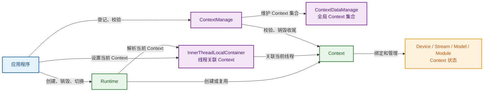

### 3.3 核心模块交互图

#### 3.3.1 默认Context

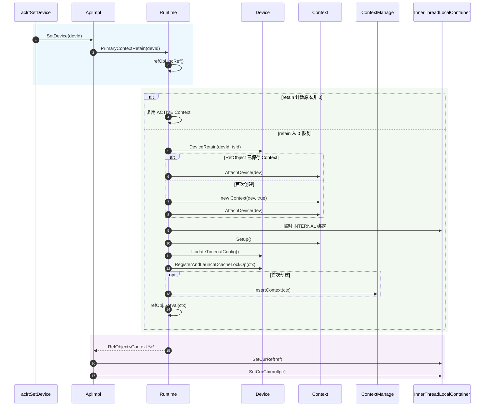

#### 3.3.2 用户Context

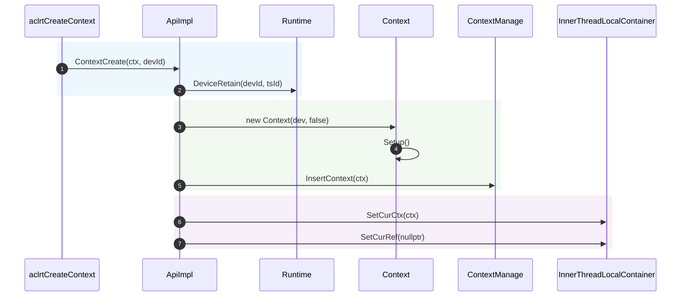

## 4. 详细设计

### 4.1 核心流程

#### 4.1.1 默认Context核心流程

##### 创建与复用流程

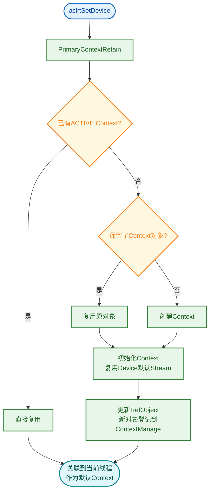

Runtime按Device/TS维护默认Context。`aclrtSetDevice()`创建或复用对应Context，必要时完成初始化，并将其关联到当前线程。

**关键代码**：

```cpp
// 文件位置：src/runtime/api/impl/api_impl.cc
rtError_t ApiImpl::SetDevice(const int32_t devId)
{
    Runtime * const rt = Runtime::Instance();
    RefObject<Context *> *context = rt->PrimaryContextRetain(static_cast<uint32_t>(devId));
    NULL_PTR_RETURN_MSG(context, RT_ERROR_DEVICE_RETAIN);
    InnerThreadLocalContainer::SetCurRef(context);
    Context * const curCtx = context->GetVal();
    CHECK_CONTEXT_VALID_WITH_RETURN(curCtx, RT_ERROR_CONTEXT_NULL);
    InnerThreadLocalContainer::SetCurCtx(nullptr);
    return RT_ERROR_NONE;
}
```

##### reset释放流程

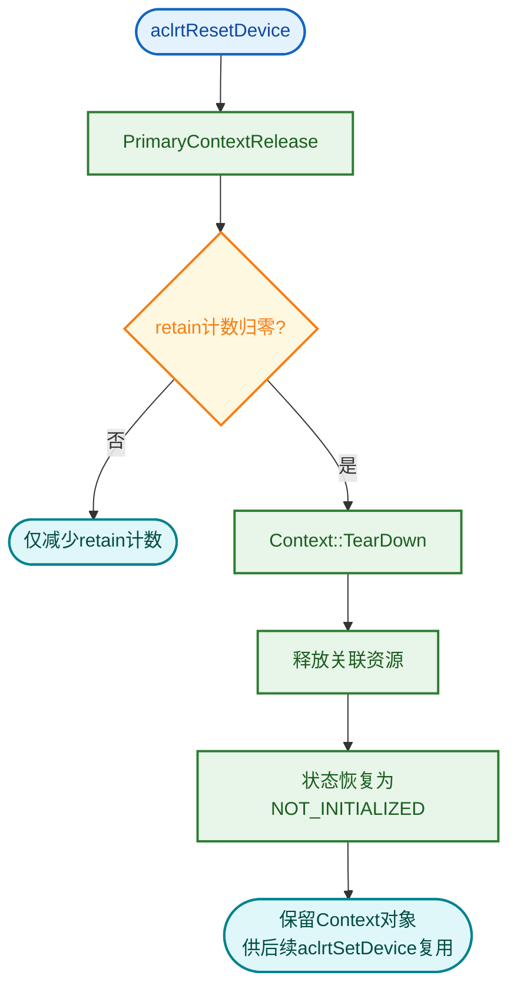

retain计数归零后，默认Context执行teardown并释放关联资源，`RefObject<Context *>`继续保留Context对象；后续`aclrtSetDevice()`重新初始化并复用该对象。

#### 4.1.2 用户Context核心流程

##### 创建流程

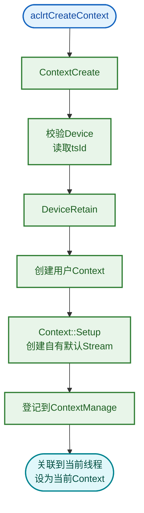

创建成功后，`ContextCreate()`立即调用`ContextSetCurrent()`，新Context因而成为当前线程关联的Context。

**关键代码**：

```cpp
// 文件位置：src/runtime/api/impl/api_impl.cc
rtError_t ApiImpl::ContextCreate(Context ** const inCtx, const int32_t devId)
{
    rtError_t error = NewContext(static_cast<uint32_t>(devId), tsId, inCtx);
    ERROR_RETURN_MSG_INNER(error, "new context failed, drv devId=%d", devId);

    ContextManage::InsertContext(*inCtx);
    error = ContextSetCurrent(*inCtx);
    ERROR_RETURN_MSG_INNER(error, "Failed to set current context");
    return RT_ERROR_NONE;
}
```

##### 销毁流程

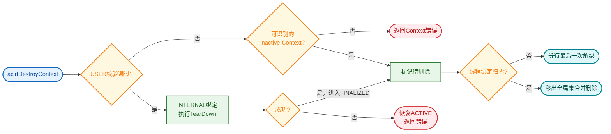

用户Context teardown期间使用INTERNAL访问；teardown成功后标记待删除，并在`threadRefCount_`归零时由`TryDeleteIfNeeded()`完成删除，详见[“销毁保护机制”章节](#434-销毁保护机制)。

#### 4.1.3 当前Context设置与获取流程

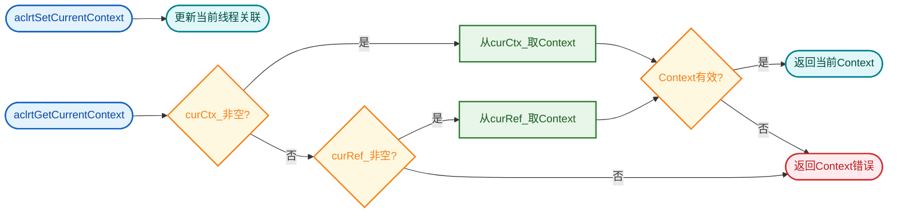

`aclrtSetCurrentContext()`将指定有效Context关联到当前线程，不区分默认Context和用户Context。

`aclrtGetCurrentContext()`优先返回`curCtx_`关联的Context；`curCtx_`为空时，再从`curRef_`获取`aclrtSetDevice()`关联的默认Context。

### 4.2 Context资源管理

Context与一个Device绑定，并管理该执行环境下的Stream、Model、Module和辅助资源。Context负责维护资源归属和回收顺序，资源的实际分配和执行能力由Device及各资源模块完成。

#### 4.2.1 资源全景

Context在`Setup()`中按需建立资源，在`TearDown()`和析构中按相反顺序回收。Context持有的资源字段包括：

```cpp
// 文件位置：src/runtime/core/inc/context/context.hpp
class Context : public NoCopy {
protected:
    Device* device_;                                // 绑定的Device
private:
    Stream* defaultStream_;                         // 默认Stream
    Stream* onlineStream_;
    std::list<Stream*> streams_;                    // 用户Stream集合
    SpinLock modelLock_;
    std::list<Model*> models_;                      // Model集合
    std::mutex moduleLock_;
    ObjAllocator<Module*>* moduleAllocator_;        // Module分配器（按Program ID）
    void* overflowAddr_ = nullptr;
    Atomic<bool> callBackThreadExist_;
    ContextCallBack threadCallBack_;                // Host Callback执行体
    std::unique_ptr<Thread> hostFuncCallBackThread_;// Host Callback线程
    // ...
};
```

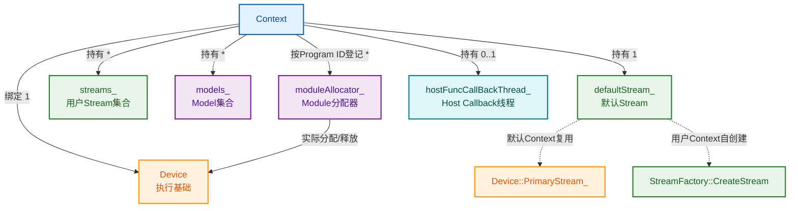

**资源归属约束**：

- **Device**：每个Context仅绑定一个Device，Context所属的Stream、Model、Module都使用该Device的执行能力。
- **Stream、Model、Module**：相关操作必须在资源所属Context下完成，不允许跨Context使用、绑定或销毁。

#### 4.2.2 Stream管理

Context主要对以下两类Stream承担管理责任：

| Stream类型 | 来源 | Context职责 | 回收路径 |
| --- | --- | --- | --- |
| 默认Stream (`defaultStream_`) | 默认Context：复用`Device::PrimaryStream_()`<br />用户Context：`StreamFactory::CreateStream` + `Setup` | 作为未显式指定Stream时的执行入口 | 用户Context：`TearDownContextStream`销毁<br />默认Context：仅解除关联 |
| 用户Stream (`streams_`) | `StreamCreate`在当前Context下显式创建后`InsertStreamList`登记 | 记录归属，Context同步/销毁时统一处理 | `TearDownOwnedStreamsOnContextTearDown`统一销毁 |

**Context同步规则**：

- `Context::Synchronize`遍历`streams_`，跳过不参与同步的Stream（`IsStreamNotSync`）；
- 处于capture状态的Stream直接报错（`RT_ERROR_STREAM_CAPTURED`）；其余Stream在任务回收后执行同步。

```cpp
// 文件位置：src/runtime/core/src/context/context.cc
rtError_t Context::Synchronize(int32_t timeout)
{
    for (const auto& syncStream : streams_) {
        if (IsStreamNotSync(syncStream->Flags())) { continue; }
        COND_RETURN_ERROR(syncStream->IsCapturing(), RT_ERROR_STREAM_CAPTURED, ...);
        COND_PROC(syncStream->IsSyncFinished() && (GetCtxMode() == ABORT_ON_FAILURE), continue;);
        syncStreams.push_back(syncStream);
    }
    (void)TaskReclaimforSyncDevice(startTime, timeout);   // 先回收任务
    const rtError_t error = CheckStatus();                // 再检查Context状态
    return SyncStreamsWithTimeout(syncStreams, timeout, startTime);
}
```

#### 4.2.3 Model管理

Context以`models_`记录在其执行环境中创建的Model，Model与Stream的绑定关系必须满足同一Context约束。

- **创建**：`ModelCreate`生成Model并由Context记录到`models_`。
- **绑定**：`ModelBindStream`要求Model与Stream属于同一Context；一个Model可绑定多个Stream。
- **回收**：Context TearDown时通过`TearDownModelsOnContextTearDown()`统一回收仍存续的Model。

```cpp
// 文件位置：src/runtime/core/src/context/context.cc
void Context::TearDownModelsOnContextTearDown()
{
    std::list<Model*> modelsToDelete;
    modelLock_.Lock();
    for (Model* tdModel : models_) {
        PrepareModelForDelete(tdModel);   // 解绑Stream、清理Executor
    }
    modelsToDelete.swap(models_);
    modelLock_.Unlock();

    for (Model* tdModel : modelsToDelete) {
        DeleteModelOnContextTearDown(tdModel);   // 真正delete
    }
}
```

#### 4.2.4 Module管理

Module由Device完成实际的内存分配和释放，Context侧通过`moduleAllocator_`按Program ID登记、查找和复用。同一Program在不同Context下分别建立Module登记关系。

- **获取**：`GetModule(prog)`按Program ID查询，存在则复用，不存在则创建并登记。
- **回收**：Context最终释放时通过`ReleaseModulesAfterTearDown()`遍历`moduleAllocator_`，释放所有未释放的Module。

```cpp
// 文件位置：src/runtime/core/src/context/context.cc
void Context::ReleaseModulesAfterTearDown()
{
    uint32_t i = 0U;
    while ((i < Runtime::maxProgramNum_) && (moduleAllocator_ != nullptr)) {
        if (!moduleAllocator_->CheckIdValid(i)) {
            i = moduleAllocator_->NextPoolFirstId(i);
            continue;
        }
        ReleaseModule(i);   // 释放该Program ID对应的Module
        i++;
    }
}
```

### 4.3 核心机制详解

Context通过**线程关联**确定当前执行上下文环境，通过**生命周期状态机**和**访问模式**控制有效性，通过**线程绑定引用**保护销毁过程，并通过**异常状态传播**控制故障后的行为。

#### 4.3.1 线程关联机制

**设计思想**：Runtime在TLS中保存每个线程独立的Context关联（`curCtx_`），使没有显式Context参数的Runtime API能够确定执行环境。线程关联同时通过`threadRefCount_`为用户Context提供销毁保护。

**两类线程关联**：

| 关联方式 | 保存位置 | 设置入口 | 是否增加`threadRefCount_` | 适用Context |
| --- | --- | --- | --- | --- |
| `curCtx_` | `Context*`直接指针 | `ContextSetCurrent`、内部`SetCurCtx` | 是（用户Context且非内部访问时） | 用户Context、内部临时绑定 |
| `curRef_` | `RefObject<Context*>*`引用对象 | `aclrtSetDevice`通过`SetCurRef` | 否（默认Context由`RefObject`自身管理生命周期） | 默认Context |

**关联建立与解除**：

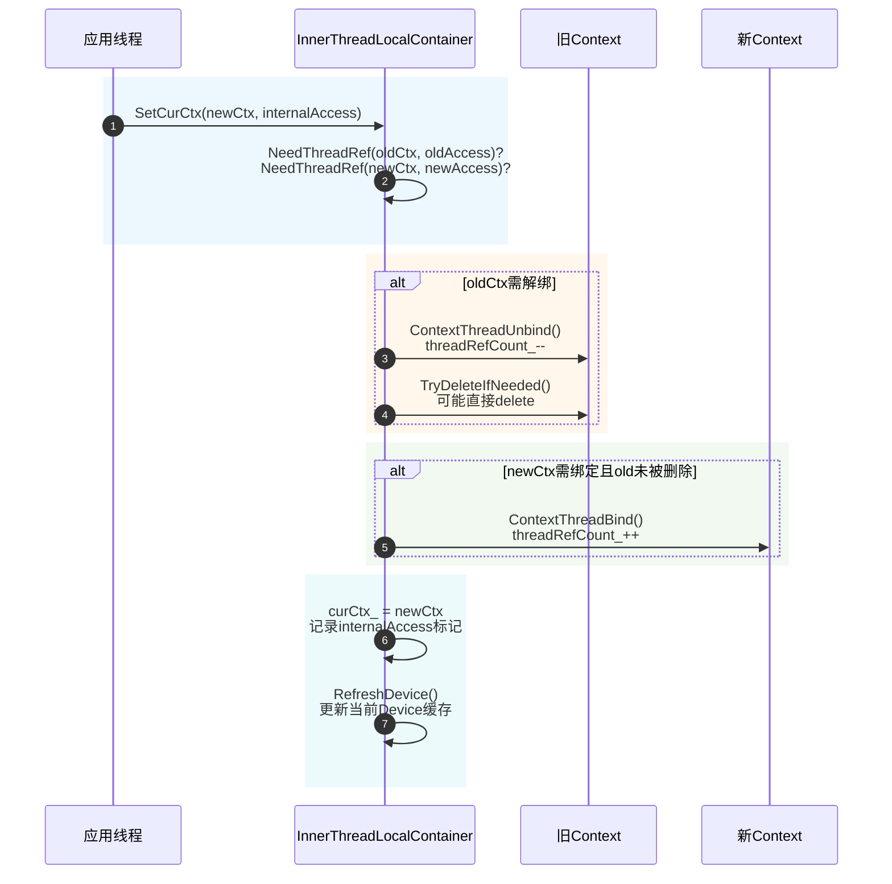

**关键代码**：

```cpp
// 文件位置：src/runtime/core/src/common/inner_thread_local.cpp
bool UpdateThreadBinding(Context* oldCtx, bool oldNeedThreadRef,
                         Context* newCtx, bool newNeedThreadRef)
{
    if (needUnbindOldCtx) {
        (void)oldCtx->ContextThreadUnbind();        // threadRefCount_--
        oldCtxDeleted = oldCtx->TryDeleteIfNeeded();// 可能是最后一次解绑
    }
    if (needBindNewCtx && ((!oldCtxDeleted) || !oldCtxIsNewCtx)) {
        newCtx->ContextThreadBind();                // threadRefCount_++
    }
    return oldCtxDeleted;
}

bool NeedThreadRef(const Context* const ctx, const bool internalAccess)
{
    // 仅"用户Context + 用户访问"才占用threadRefCount_
    return (ctx != nullptr) && !internalAccess && !ctx->IsPrimary();
}
```

**机制要点**：

1. **线程间隔离**：`curCtx_`是TLS变量，切换只影响当前线程。
2. **多线程共享**：同一用户Context可被多线程关联，每个线程独立绑定/解绑。

#### 4.3.2 生命周期状态机

**设计思想**：Context通过`lifecycleState_`原子状态机管理整个生命周期，所有状态切换通过`TrySwitchState`或`SetState`完成，保证多线程并发下的状态一致性。

**状态定义与转换**：

```cpp
// 文件位置：src/runtime/core/inc/context/context.hpp
enum class ContextState : uint8_t {
    CTX_STATE_NOT_INITIALIZED = 0U,   // 未初始化/reset后等待复用
    CTX_STATE_INITIALIZING    = 1U,   // Setup运行中，仅内部访问
    CTX_STATE_ACTIVE          = 2U,   // 用户API可访问
    CTX_STATE_FINALIZING      = 3U,   // TearDown运行中，用户访问被阻断
    CTX_STATE_FINALIZED       = 4U,   // TearDown完成，资源未完全释放
    CTX_STATE_DEINITIALIZING  = 5U,   // 最终释放中
};
```

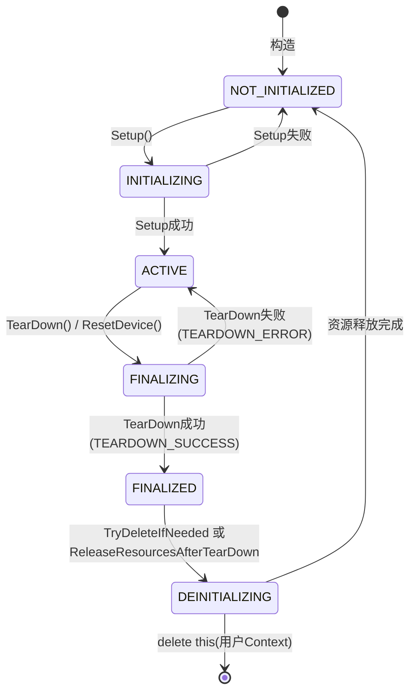

**关键代码**：

```cpp
// 文件位置：src/runtime/core/src/context/context.cc
bool Context::TrySwitchState(const ContextState expectedState,
                              const ContextState targetState, const char_t* const trigger)
{
    ContextState expected = expectedState;
    const bool switched = lifecycleState_.compare_exchange_strong(
        expected, targetState, std::memory_order_acq_rel);
    if (switched) { LogStateTransition(expectedState, targetState, trigger); }
    return switched;
}
```

**机制要点**：

- `FINALIZING`是阻断用户访问的状态：进入此状态后，所有用户API访问立即被拒绝。
- `FINALIZED`是中间态：TearDown完成、子资源已回收，但Module/Device引用等最终资源尚未释放。
- `DEINITIALIZING`是唯一允许释放对象的状态，由`TryDeleteIfNeeded`或析构路径触发。

#### 4.3.3 Context handle有效性校验与访问模式

**设计思想**：所有用户API入口通过`CheckContextIsValid`统一校验Context可用性。校验分两步——先查全局有效集合（读写锁保护的`unordered_set`），再查状态机；两步都通过才放行。同时，用户态校验失败会主动解除当前线程与该Context的关联，避免线程长期持有一个已失效的handle。

**访问模式**：

```cpp
// 文件位置：src/runtime/core/inc/context/context_manage.hpp
enum class ContextAccessMode : uint8_t {
    USER = 0,        // 用户API访问，要求Context处于ACTIVE
    INTERNAL = 1,    // Runtime内部访问，允许INITIALIZING/FINALIZING
};
```

**校验流程**：

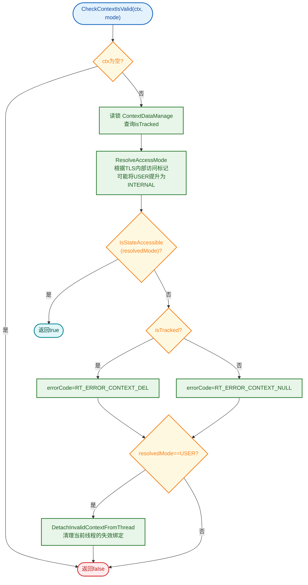

**关键代码**：

```cpp
// 文件位置：src/runtime/core/src/context/context_manage.cc
bool ContextManage::CheckContextIsValid(Context* const curCtx,
    ContextAccessMode accessMode, rtError_t* errorCode)
{
    if (curCtx == nullptr) { return false; }
    {
        const ReadProtect rp(&(g_ctxMan.GetSetRwLock()));
        const bool isTracked = g_ctxMan.ExistsSetValueWithoutLock(curCtx);
        const ContextAccessMode resolvedAccessMode = ResolveAccessMode(curCtx, accessMode);
        if (IsContextAccessAllowed(curCtx, resolvedAccessMode, isTracked)) {
            return true;
        }
        needDetachUserBinding = (resolvedAccessMode == ContextAccessMode::USER);
    }
    if (needDetach && needDetachUserBinding) {
        DetachInvalidContextFromThread(curCtx);
    }
    return false;
}
```

**状态-访问模式矩阵**（`Context::IsStateAccessible`）：

| Context状态 | USER访问 | INTERNAL访问 |
| --- | --- | --- |
| `ACTIVE` | ✅ 允许 | ✅ 允许 |
| `INITIALIZING` | ❌ 拒绝 | ✅ 允许 |
| `FINALIZING` | ❌ 拒绝 | ✅ 允许 |
| `NOT_INITIALIZED` / `FINALIZED` / `DEINITIALIZING` | ❌ 拒绝 | ❌ 拒绝 |

**机制要点**：

- **TRACKED是USER访问前提**：用户Context必须已`InsertContext`登记到全局集合才允许USER访问；未登记的Context仅当当前线程已绑定且为INTERNAL时可用（用于`aclrtCreateContext`在`InsertContext`前的`Setup`窗口）。
- **校验失败自动清理**：USER模式校验失败时，`DetachInvalidContextFromThread`会解除当前线程对该Context的绑定；解绑可能是最后一次引用，从而触发`TryDeleteIfNeeded`。
- **访问模式提升**：`ResolveAccessMode`检查当前线程TLS的`internalAccess`标记，若线程已处于内部访问上下文，则自动按INTERNAL校验。

#### 4.3.4 销毁保护机制

**设计思想**：用户Context的销毁分为**停止对外使用并清理资源**和**删除Context对象**两个阶段。销毁开始时，切换Context状态到`FINALIZING`，阻止新的用户API访问，再通过`TearDown()`清理关联资源；清理成功后将Context标记为“待删除”。待所有用户线程解除关联后，才删除Context对象，避免对象释放后仍被访问（Use-After-Free，UAF）。

**销毁保护字段**：

```cpp
// 文件位置：src/runtime/core/inc/context/context.hpp
class Context {
    std::atomic<uint64_t> threadRefCount_;   // 用户线程绑定计数
    Atomic<bool> isNeedDelete_;              // TearDown完成后置位
    std::atomic<bool> deleteScheduled_;      // 保证delete只触发一次
};
```

**销毁流程**：

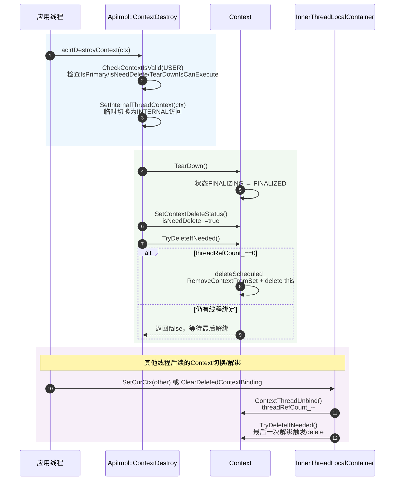

**关键代码**：

```cpp
// 文件位置：src/runtime/core/src/context/context.cc
bool Context::TryDeleteIfNeeded()
{
    if (isPrimary_ || !GetContextIsNeedDelStatus()) {
        return false;                          // 默认Context或未标记删除
    }
    if (GetThreadRefCount() != 0U) {
        return false;                          // 仍有用户线程绑定
    }
    bool expected = false;
    if (!deleteScheduled_.compare_exchange_strong(expected, true, ...)) {
        return false;                          // 已有线程进入删除路径
    }
    SetState(ContextState::CTX_STATE_DEINITIALIZING, "TryDeleteIfNeeded");
    (void)ContextManage::RemoveContextFromSet(this);
    delete this;                               // 触发~Context → ReleaseResourcesAfterTearDown
    return true;
}
```

**机制要点**：

1. **三重删除前提**：非Primary + `isNeedDelete_==true` + `threadRefCount_==0`，缺一不可。
2. **`deleteScheduled_`原子标志**：保证多线程并发解绑时只有一个线程执行`delete this`。
3. **删除即析构**：`delete this`触发`~Context`→`ReleaseResourcesAfterTearDown`，完成资源释放。
4. **TLS兜底清理**：`ClearDeletedContextBinding`确保其他线程后续的`SetCurCtx`不会再持有已删除Context的指针。

#### 4.3.5 异常处理机制

**设计思想**：

- ctxMode_作为遇错即停开关，用于控制Context发生异常后的处理方式。
- Context将异常分为**最近错误**（`lastErr_`）和**失败状态**（`failureError_`）两条通道。前者保留最近一次API错误供查询；后者在同步或任务下发前决定是否允许继续执行。

**失败模式控制**：

```cpp
// 文件位置：src/runtime/core/inc/context/context.hpp
TsStreamFailureMode GetCtxMode() const { return ctxMode_; }
void SetCtxMode(const TsStreamFailureMode flag) { ctxMode_ = flag; }
```

- **开启遇错即停**：`aclrtSetStreamFailureMode(stream, ACL_STOP_ON_FAILURE)`→ Context内部`SetCtxMode(STOP_ON_FAILURE)`。
- **`ctxMode_`是遇错即停开关，`failureError_`是异常码**：`ctxMode_`决定遇错后行为；`failureError_`只是当前失败状态对应的异常码记录。

**机制要点**：

1. **Device/Driver异常优先级最高**：无论`ctxMode_`如何都直接返回错误，避免在异常设备上继续下发任务。
2. **`CONTINUE_ON_FAILURE`是默认模式**：保留`failureError_`供后续查询，但不阻断当前路径，便于业务侧容错。
3. **`STOP_ON_FAILURE`立即阻断**：返回`failureError_`并阻止后续任务下发，便于快速失败定位。
4. **设备级传播按Device ID**（`SetGlobalFailureErr`）：异步Stream错误写入所属Context；设备级严重异常遍历`ContextDataManage`，对所有`IsContextOnDevice`的Context同步`SetFailureError`+`SetStreamsStatus`+`SetDeviceStatus`。

**错误通道对比**：

| 维度 | `lastErr_` | `failureError_` |
| --- | --- | --- |
| 写入方 | 一般API返回错误时由`SetGlobalErrToCtx`写入 | 异步Stream错误或设备级严重异常时由`SetGlobalFailureErr`写入 |
| 读取方 | `GetContextLastErr`读取并清零<br />`PeekContextLastErr`读取保留 | `CheckStatus`/`CheckTaskSend`在执行前查询 |
| 作用范围 | 当前线程关联的Context | 该Device上所有Context（按Device ID传播） |
| 生命周期 | 读取即清零（一次性） | 直到Device恢复或Context销毁 |

**执行前检查流程**：

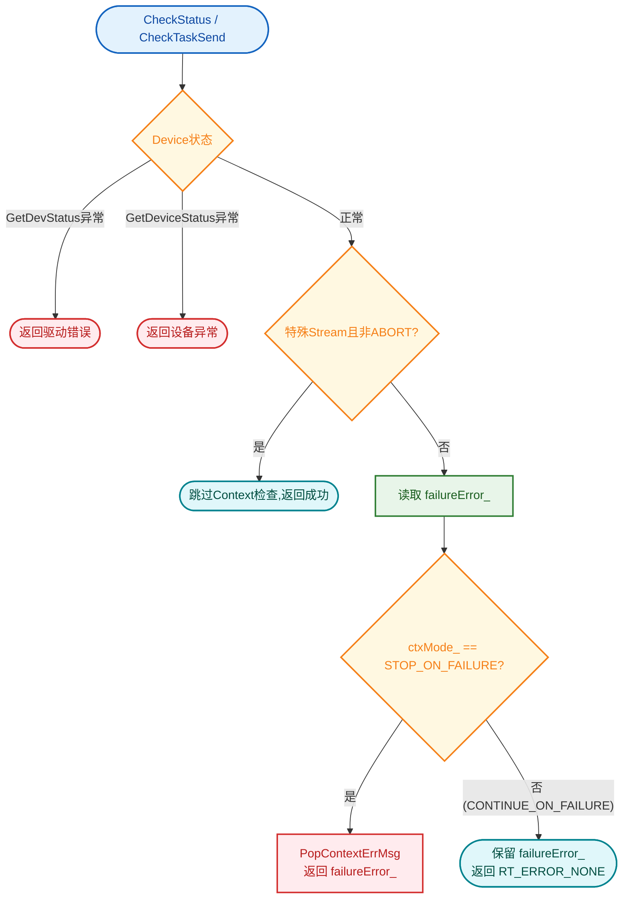

**关键代码**：

```cpp
// 文件位置：src/runtime/core/src/context/context.cc
rtError_t Context::CheckStatus(const Stream* const stm, const bool isBlockDefault)
{
    // 1. Device/Driver状态优先检查（不受ctxMode_影响）
    status = device_->GetDevStatus();
    COND_PROC_RETURN_ERROR_MSG_CALL(ERR_MODULE_DRV, status != RT_ERROR_NONE, ...);
    status = device_->GetDeviceStatus();
    COND_RETURN_ERROR(status != RT_ERROR_NONE, ...);

    // 2. 特殊Stream（CtrlSQ/Primary）且非ABORT模式：跳过Context检查
    if (!isBlockDefault && (stm != nullptr) && ... && (stm->GetFailureMode() != ABORT_ON_FAILURE)) {
        return RT_ERROR_NONE;
    }

    // 3. Context失败状态按模式处理
    status = GetFailureError();
    if (status != RT_ERROR_NONE) { PopContextErrMsg(); }
    if (ctxMode_ != STOP_ON_FAILURE) { return RT_ERROR_NONE; }   // 继续执行
    return status;
}
```

### 4.4 模块职责划分

| 核心模块或类 | 主要职责 | 与Context的关联 |
| --- | --- | --- |
| `ApiImpl` | 实现Context创建、销毁、设置当前和获取当前等核心操作 | 调用`Runtime`管理默认Context，通过`ContextManage`登记或校验Context，并更新线程关联 |
| `Runtime` | 维护默认Context对象及其引用计数，联动Device生命周期并解析当前Context | 创建或复用默认Context，从线程局部存储解析当前Context |
| `Context` | Context生命周期和资源管理主体 | 绑定Device，管理Stream、Model、Module、错误状态及线程关联引用 |
| `ContextManage` | Context登记、有效性校验、销毁收尾和异常传播 | 通过`ContextDataManage`维护全局Context集合，并对Context执行状态检查 |
| `ContextDataManage` | 对全局Context集合提供插入、移除、存在性查询和遍历访问 | 为有效性校验提供数据基础；快速恢复和Snapshot也会遍历该集合 |
| `InnerThreadLocalContainer` | 保存当前线程关联的用户或默认Context，以及INTERNAL访问标记 | 建立或解除线程与Context的关联，并触发线程引用增减 |

### 4.5 核心数据结构

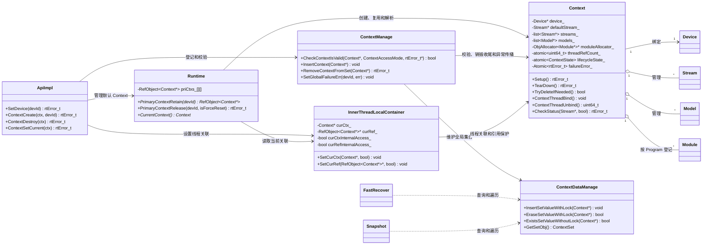

## 5. 关键文件索引

| 模块 | 文件路径 | 核心内容 |
| --- | --- | --- |
| ACL公开头文件 | `include/external/acl/acl_rt.h` | ACL Context API声明和接口约束 |
| ACL C入口 | `src/acl/aclrt_c/runtime/context.c` | ACL Context C符号入口，转调wrapper |
| ACL实现 | `src/acl/aclrt_impl/context.cpp` | ACL Context实现、参数校验、错误码转换 |
| Runtime Context头文件 | `pkg_inc/runtime/runtime/context.h` | Runtime Context handle和内部C API声明 |
| RTS Context头文件 | `pkg_inc/runtime/runtime/rts/rts_context.h` | RTS Context内部C API声明 |
| Runtime C API | `src/runtime/api/api_c.cc` | Context C层转调入口 |
| RTS C API | `src/runtime/api/api_c_context.cc` | Context RTS转调入口 |
| Device C API | `src/runtime/api/api_c_device.cc` | Device设置与复位的Runtime实现，以及默认Context生命周期联动 |
| API抽象 | `src/runtime/api/api.hpp` | Context相关虚接口定义 |
| ApiError | `src/runtime/api/impl/api_error.cc` | Context API参数校验、空指针校验和资源绑定关系校验 |
| Profiling装饰器 | `src/runtime/core/src/profiler/api_profile_decorator.cc`、`src/runtime/core/src/profiler/api_profile_log_decorator.cc` | Context API Profiling记录 |
| ApiImpl | `src/runtime/api/impl/api_impl.cc` | Context创建、销毁、线程绑定实现 |
| Runtime | `src/runtime/core/inc/runtime.hpp`、`src/runtime/core/src/runtime.cc` | 默认Context retain/release、当前Context解析、内部访问上下文 |
| Context头文件 | `src/runtime/core/inc/context/context.hpp` | Context类、状态机、访问模式、校验宏、核心方法声明 |
| Context实现 | `src/runtime/core/src/context/context.cc` | Context生命周期、资源管理、状态迁移、线程绑定引用、同步和错误状态 |
| Context平台实现 | `src/runtime/core/src/context/context_standard_soc.cc`、`src/runtime/core/src/context/context_tiny_stub.cc` | 标准平台和tiny stub的Context差异实现 |
| ContextManage | `src/runtime/core/inc/context/context_manage.hpp`、`src/runtime/core/src/context/context_manage.cc` | 全局Context集合、USER/INTERNAL有效性校验、inactive销毁收尾、设备异常传播 |
| ContextDataManage | `src/runtime/core/src/common/context_data_manage.h`、`src/runtime/core/src/common/context_data_manage.cc` | Context集合的增删、查询和遍历；同时供有效性校验、快速恢复及Snapshot使用 |
| InnerThreadLocalContainer | `src/runtime/core/inc/common/inner_thread_local.hpp`、`src/runtime/core/src/common/inner_thread_local.cpp` | 线程局部存储中的当前Context、内部访问标记、线程关联引用加减 |

## 6. 设计约束与维护建议

- 默认Context由Device设置/复位路径管理，用户显式销毁接口不能销毁`IsPrimary()`为true的Context。
- Stream、Model、Module等资源的操作必须在资源所属Context下完成，不允许跨Context使用、绑定或销毁。
- 新增接收`Context *`或依赖当前Context的API时，必须明确使用USER或INTERNAL访问模式；对外API默认使用USER。
- teardown/reset的内部资源访问必须使用`Runtime::SetInternalThreadContext()`或等价INTERNAL绑定。

---

_本模块文档基于 `src/runtime/core/src/context/`、`src/runtime/core/src/runtime.cc`、`src/runtime/api/impl/api_impl.cc`、`src/runtime/core/src/common/inner_thread_local.cpp`及Context相关API源码分析整理。_
