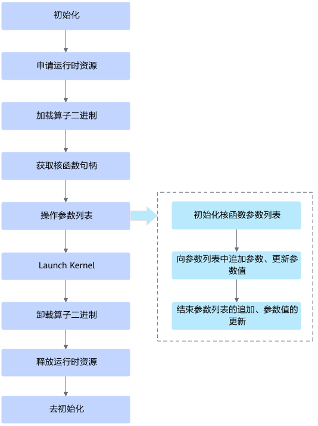
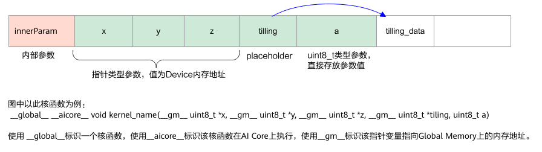

# 概念及使用说明

## 相关概念

本章中的接口涉及对算子的算子二进制、核函数、核函数参数列表以及参数的操作，为便于理解，您可以先通过下图了解它们之间的关系。

- **算子二进制**：编译算子源码，可得到算子二进制文件\*.o。对于CANN内置算子，可从算子二进制包（包名为Ascend-cann-kernels-\*.run）中获取算子二进制文件。对于自定义算子，可在编译算子、发布二进制之后获取算子二进制文件。自定义算子的开发、编译请参见[《Ascend C算子开发》](https://hiascend.com/document/redirect/CannCommunityOpdevAscendC)。
- **核函数**：是算子设备侧实现的入口函数。当前允许使用C/C++函数的语法扩展来编写设备端的运行代码，用户在核函数中进行数据访问和计算操作，由此实现该算子的所有功能。

## Kernel加载与执行接口调用流程

关键流程说明如下：

1. 调用[acl.init](../init/function-init.md)接口初始化。
2. 申请运行时资源，包括调用[acl.rt.set\_device](../device/function-set_device.md)接口指定用于运算的Device、调用[acl.rt.create\_stream](../stream/function-create_stream.md)接口创建Stream。

    详细说明请参见《应用开发》Python部分的运行时资源申请与释放。

3. 调用[acl.rt.binary\_load\_from\_file](function-binary_load_from_file.md)接口加载算子二进制文件。
4. 调用[acl.rt.binary\_get\_function](function-binary_get_function.md)接口获取核函数句柄。
5. 根据核函数句柄操作其参数列表，操作包括：
    1. **初始化参数列表**

        当前支持由系统管理内存（调用[acl.rt.kernel\_args\_init](function-kernel_args_init.md)接口）、由用户管理内存（调用[acl.rt.kernel\_args\_init\_by\_user\_mem](function-kernel_args_init_by_user_mem.md)接口）两种方式。

    2. **追加参数、更新参数值**

        核函数参数列表中包含不同类型的参数，例如指针类型参数、placeholder、uint8\_t类型参数等，其中：

        - 指针类型参数：其值为Device内存地址。一般来说，算子的输入、输出是该种类型的参数，用户需提前调用Device内存申请接口（例如[acl.rt.malloc](../memory/function-malloc.md)接口）申请内存，并自行拷贝数据至Device侧。
        - placeholder：也是指针类型参数，但区别在于，用户无需手动将参数数据复制到Device，这项操作由Runtime完成。在追加参数时Runtime并不会填写真实的Device地址，而是在Launch Kernel时才会刷新为真实的Device地址，所以称之为placeholder。对算子的非输入、输出参数，可以使用placeholder方式，将小块数据（建议小于2KB）的Host-\>Device拷贝合并到Launch Kernel时的一次拷贝操作中去，减少拷贝次数，提升性能。

        

        **不同类型参数，可调用不同的参数追加接口：**

        - 对于placeholder参数，由于关联的内存必须放在所有参数之后，所以在追加参数时，先调用[acl.rt.kernel\_args\_append\_place\_holder](function-kernel_args_append_place_holder.md)接口占位，等所有参数都追加之后，可调用[acl.rt.kernel\_args\_get\_place\_holder\_buffer](function-kernel_args_get_place_holder_buffer.md)接口获取对应占位符指向的内存地址。用户可根据获取的内存地址，管理该内存中的数据。
        - 对于非placeholder参数（例如指针类型参数、uint8\_t类型参数等），调用[acl.rt.kernel\_args\_append](function-kernel_args_append.md)接口将用户设置的参数值追加拷贝到argsHandle指向的参数数据区域。如果要更新参数值，可调用[acl.rt.kernel\_args\_para\_update](function-kernel_args_para_update.md)接口进行更新。

        **注意**，核函数参数列表中，实际可能存在多个参数，并且不同类型的参数可能交错出现，因此需要按照参数列表中的参数顺序从左到右进行追加，追加的参数最多支持128个。

    3. **结束参数列表的追加、参数值的更新**

        在所有参数追加之后，调用[acl.rt.kernel\_args\_finalize](function-kernel_args_finalize.md)接口以标识参数组装完毕。但[acl.rt.kernel\_args\_finalize](function-kernel_args_finalize.md)接口之后，也支持继续更新参数值，更新之后，还要再调用一次[acl.rt.kernel\_args\_finalize](function-kernel_args_finalize.md)接口。

6. 调用[acl.rt.launch\_kernel\_with\_config](function-launch_kernel_with_config.md)接口Launch Kernel，启动对应算子的计算任务。
7. 调用接口[acl.rt.binary\_unload](function-binary_unload.md)卸载算子二进制文件。
8. 释放运行时资源，包括调用[acl.rt.destroy\_stream](../stream/function-destroy_stream.md)接口释放Stream、调用[acl.rt.reset\_device](../device/function-reset_device.md)接口释放Device上的资源。

    详细说明请参见《应用开发》Python部分的运行时资源申请与释放。

9. 调用[acl.finalize](../init/function-finalize.md)接口去初始化。
