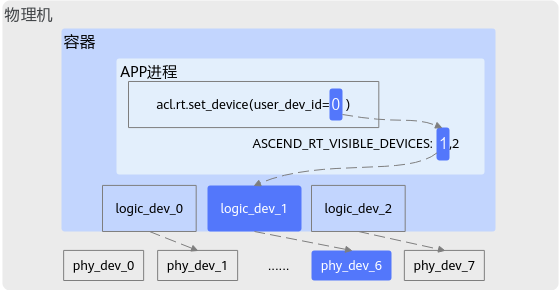

# 函数：get\_logic\_dev\_id\_by\_user\_dev\_id

## 产品支持情况

<!-- npu="950" id1 -->
- Ascend 950PR&950DT系列产品：支持
<!-- end id1 -->
<!-- npu="A3" id2 -->
- Atlas A3系列产品：支持
<!-- end id2 -->
<!-- npu="910b" id3 -->
- Atlas A2系列产品：支持
<!-- end id3 -->
<!-- npu="310b" id4 -->
- Atlas 200I/500 A2推理产品：支持
<!-- end id4 -->
<!-- npu="310p" id5 -->
- Atlas推理系列产品：支持
<!-- end id5 -->
<!-- npu="910" id6 -->
- Atlas训练系列产品：支持
<!-- end id6 -->

## 功能说明

根据用户设备ID获取对应的逻辑设备ID。

## 函数原型

- **C函数原型**

    ```c
    aclError aclrtGetLogicDevIdByUserDevId(const int32_t userDevid, int32_t *const logicDevId)
    ```

- **python函数**

    ```python
    logic_dev_id, ret = acl.rt.get_logic_dev_id_by_user_dev_id(user_dev_id)
    ```

## 参数说明

| 参数名 | 说明 |
| --- | --- |
| user_dev_id | int，用户设备ID。 |

## 返回值说明

| 返回值 | 说明 |
| --- | --- |
| logic_dev_id | int，逻辑设备ID。 |
| ret | int，返回0表示成功，返回[其它值](../datatypes/aclError.md)表示失败。 |

## 用户设备ID、逻辑设备ID、物理设备ID之间的关系

若未设置ASCEND\_RT\_VISIBLE\_DEVICES环境变量，逻辑设备ID与用户设备ID相同；若在非容器场景下，物理设备ID与逻辑设备ID相同。

下图以容器场景且设置ASCEND\_RT\_VISIBLE\_DEVICES环境变量为例说明三者之间的关系：通过ASCEND\_RT\_VISIBLE\_DEVICES环境变量设置的Device ID依次为**1**、2，对应的Device索引值依次为**0**、1，通过[acl.rt.set\_device](function-set_device.md)接口设置的用户设备ID为**0**，即对应的Device索引值为**0**，因此用户设备ID=**0**对应逻辑设备ID=**1**，容器中的逻辑设备ID=**1**又映射到物理设备ID=**6**，因此最终是使用ID为6的物理设备进行计算。

**图 1**


关于ASCEND\_RT\_VISIBLE\_DEVICES环境的详细介绍请参见[《环境变量参考》](https://hiascend.com/document/redirect/CannCommunityEnvRef)。
