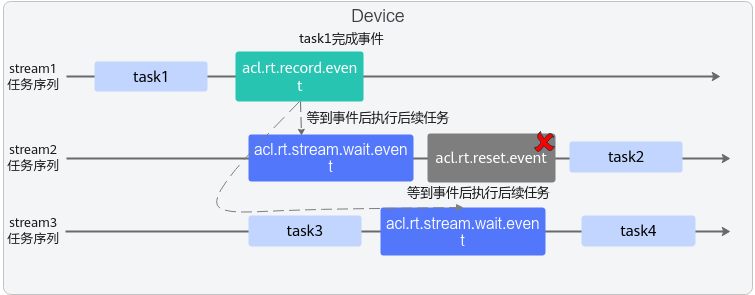

# 函数：reset\_event

## 产品支持情况

<!-- npu="950" id1 -->
- Ascend 950PR&950DT系列产品：支持
<!-- end id1 -->
<!-- npu="A3" id2 -->
- Atlas A3系列产品：支持
<!-- end id2 -->
<!-- npu="910b" id3 -->
- Atlas A2系列产品：支持
<!-- end id3 -->
<!-- npu="310b" id4 -->
- Atlas 200I/500 A2推理产品：支持
<!-- end id4 -->
<!-- npu="310p" id5 -->
- Atlas推理系列产品：支持
<!-- end id5 -->
<!-- npu="910" id6 -->
- Atlas训练系列产品：支持
<!-- end id6 -->

## 功能说明

复位一个Event。用户需确保等待Stream中的任务都完成后，再复位Event，异步接口。

对于多个Stream间任务同步的场景，通常在调用[acl.rt.stream\_wait\_event](function-stream_wait_event.md)接口之后再复位Event。

## 函数原型

- **C函数原型**

    ```c
    aclError aclrtResetEvent(aclrtEvent event, aclrtStream stream)
    ```

- **python函数**

    ```python
    ret = acl.rt.reset_event(event, stream)
    ```

## 参数说明

| 参数名 | 说明 |
| --- | --- |
| event | int，待复位的Event对象的指针地址。 |
| stream | int，指定Event所在的Stream的对象指针地址。<br>多个Stream间任务同步的场景，例如，Stream2中的任务依赖Stream1中的任务时，此处配置为Stream2。 |

## 返回值说明

| 返回值 | 说明 |
| --- | --- |
| ret | int，错误码，返回0表示成功，返回[其它值](../datatypes/aclError.md)表示失败。 |

## 约束说明

仅支持复位由[acl.rt.creat\_event\_with\_flag](function-create_event_with_flag.md)接口创建的、带有ACL\_EVENT\_SYNC标志的Event。

**注意，**在多个Stream中的任务需要等待同一个Event的情况下，不建议调用此接口来复位Event。如图所示，如果在stream2中的aclrtStreamWaitEvent接口之后调用aclrtResetEvent接口，Event将被复位，这会导致stream3中的aclrtStreamWaitEvent接口无法成功。


