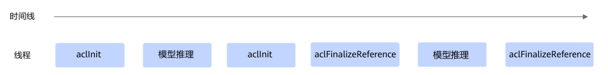

# 函数：init

## 产品支持情况

<!-- npu="950" id1 -->
- Ascend 950PR&950DT系列产品：支持
<!-- end id1 -->
<!-- npu="A3" id2 -->
- Atlas A3系列产品：支持
<!-- end id2 -->
<!-- npu="910b" id3 -->
- Atlas A2系列产品：支持
<!-- end id3 -->
<!-- npu="310b" id4 -->
- Atlas 200I/500 A2推理产品：支持
<!-- end id4 -->
<!-- npu="310p" id5 -->
- Atlas推理系列产品：支持
<!-- end id5 -->
<!-- npu="910" id6 -->
- Atlas训练系列产品：支持
<!-- end id6 -->

## 功能说明

初始化函数。

## 函数原型

- **C函数原型**

    ```c
    aclError aclInit(const char *configPath)
    ```

- **python函数**

    ```python
    ret = acl.init(config_path)
    ```

## 参数说明

| 参数名 | 说明 |
| --- | --- |
| config_path | 配置文件所在的路径，包含文件名。<br>配置文件内容为JSON格式（JSON文件内的“{”的层级最多为10，“[”的层级最多为10）。初始化时，可通过该配置文件配置开启Dump、配置Profiling采集信息等功能，详细描述请参见下文各功能配置示例中的描述。如果以下的默认配置已满足需求，无需修改，可直接调用acl.init接口不传入参数或者可将配置文件配置为空JSON串（即配置文件中只有{}）。 |

## 返回值说明

| 返回值 | 说明 |
| --- | --- |
| ret | int，错误码，返回0表示成功，返回[其它值](../datatypes/aclError.md)表示失败。 |

## 约束说明

- 使用pyacl接口开发应用时，必须先调用acl.init接口，否则可能会导致后续系统内部资源初始化出错，进而导致其它业务异常。

- 一个进程内支持多次调用aclInit接口初始化，但需调用aclFinalize或aclFinalizeReference接口去初始化，支持以下场景：
  - 每次调用aclInit接口时，配置必须保持一致，否则仅首次调用的配置有效，后续调用aclInit接口可能会导致报错或配置无效。
  - 为兼容旧版本，重复调用aclInit接口会返回ACL\_ERROR\_REPEAT\_INITIALIZE错误码，您可以忽略该错误继续处理业务。
  - 若调用aclInit、aclFinalize接口分别实现初始化、去初始化，支持重复初始化、去初始化，时序上仅支持顺序调用，接口调用时序如下：

    ```text
    aclInit-->业务处理-->aclFinalize-->aclInit-->业务处理-->aclFinalize
    ```

    该场景下，如果调用多次aclInit接口后，再去初始化，仅需调用一次aclFinalize接口，将aclInit接口的引用计数直接清零。

  - 若调用aclInit、aclFinalizeReference接口分别实现初始化、去初始化，则需成对调用aclInit、aclFinalizeReference接口。

    因为aclFinalizeReference接口内部涉及引用计数的实现，aclInit接口每被调用一次，则引用计数加一，aclFinalizeReference接口每被调用一次，则该引用计数减一，当引用计数减到0时，才会真正去初始化。

    支持重复初始化、去初始化，时序上支持顺序调用，也支持并发调用，接口调用时序如下：

    - 顺序调用时序图如下：

        

    - 并发调用时序图如下：

        

## 模型Dump配置、单算子Dump配置示例

模型Dump配置（用于导出模型中每一层算子输入和输出数据）、单算子Dump配置（用于导出单个算子的输入和输出数据），导出的数据用于与指定模型或算子进行比对，定位精度问题，具体比对方法请参见[《精度调试工具》](https://hiascend.com/document/redirect/CannCommunityToolAccucacy)。默认不启用该dump配置。

通过本接口启用Dump配置，需通过dump\_path参数配置保存Dump数据的路径。详细参数解释请参见[《精度调试工具》](https://hiascend.com/document/redirect/CannCommunityToolAccucacy)中的“NPU vs NPU（离线推理）\> 准备离线模型dump数据文件”。

模型Dump配置示例如下：

```json
{                                                                                            
 "dump":{
  "dump_list":[                                                                        
   { "model_name":"ResNet-101"
   },
   {                                                                                
    "model_name":"ResNet-50",
    "layer":[
          "conv1conv1_relu",
          "res2a_branch2ares2a_branch2a_relu",
          "res2a_branch1",
          "pool1"
    ] 
   }  
  ],  
  "dump_path":"/home/output",
                "dump_mode":"output",
  "dump_op_switch":"off",
                "dump_data":"tensor"
 }                                                                                        
}
```

单算子调用场景下，Dump配置示例如下：

```json
{
    "dump":{
        "dump_path":"output",
        "dump_list":[], 
 "dump_op_switch":"on",
        "dump_data":"tensor"
    }
}
```

## 异常算子Dump配置示例

**异常算子Dump配置**（用于导出异常算子的输入输出数据、workspace信息、Tiling信息），导出的数据用于分析AI Core Error问题。默认不启用该dump配置。

关于AI Core Error问题的信息收集及定位，详细说明请参见《[故障处理]( https://www.hiascend.com/document/detail/zh/CANNCommunityEdition/latest/maintenref/troubleshooting/docs/zh/troubleshooting/troubleshooting_intro.md)》中的“典型故障专题 \> AI Core Error问题定位专题”。

通过配置dump\_scene参数值开启异常算子Dump功能，配置文件中的示例内容如下，表示开启轻量化的exception dump：

```json
{
    "dump":{
        "dump_path":"output",
        "dump_scene":"aic_err_brief_dump"
    }
}
```

详细配置说明及约束如下：

- dump\_scene参数支持如下取值：
  - aic\_err\_brief\_dump：表示轻量化exception dump，用于导出AI Core错误算子的输入&输出、workspace数据。
  - aic\_err\_norm\_dump：表示普通exception dump，在轻量化exception dump基础上，还会导出Shape、Data Type、Format以及属性信息。
  <!-- npu="A3,910b" id7 -->
  - aic\_err\_detail\_dump：在轻量化exception dump基础上，还会导出AI Core的内部存储、寄存器以及调用栈信息。

    配置该选项时，有以下注意事项：

    - 该选项仅支持以下型号，且需配套25.0.RC1或更高版本的驱动才可以使用：

        <!-- npu="910b" id8 -->
        Atlas A2系列产品
        <!-- end id8 -->

        <!-- npu="A3" id9 -->
        Atlas A3系列产品
        <!-- end id9 -->

        您可以单击[Link](https://www.hiascend.com/hardware/firmware-drivers)，下载Ascend HDK  25.0.RC1或更高版本的驱动安装包，并参考相应版本的文档进行安装、升级。

    - 导出dump文件过程中，会暂停问题算子所在的AI Core，因此可能会影响Device上其它业务进程的正常执行，导出dump文件后，会自行恢复AI Core。因此，多个Host侧用户业务进程指定同一个Device的场景下，不建议使用aic\_err\_detail\_dump选项。
    - 导出dump文件后，会强制退出Host侧用户业务进程，强制退出过程中的报错可不作为AI Core问题分析的输入。
    - 配置aic\_err\_detail\_dump选项后，如果生成了dump文件，但不是\*.core文件，则表示aic\_err\_detail\_dump对应的功能没有使能成功，系统自动切换为按aic\_err\_brief\_dump选项dump。
  <!-- end id7 -->

  - lite\_exception：表示轻量化exception dump，为了兼容旧版本，效果等同于aic\_err\_brief\_dump。

- dump\_path是可选参数，表示导出dump文件的存储路径。

    dump文件存储路径的优先级如下：NPU\_COLLECT\_PATH环境变量 \> ASCEND\_WORK\_PATH环境变量 \> 配置文件中的dump\_path \> 应用程序的当前执行目录

    环境变量的详细描述请参见[《环境变量参考》](https://hiascend.com/document/redirect/CannCommunityEnvRef)。

- 若需查看导出的dump文件内容，先将dump文件转换为numpy格式文件后，再通过Python查看numpy格式文件，详细转换步骤请参见[《精度调试工具》](https://hiascend.com/document/redirect/CannCommunityToolAccucacy)中的“扩展功能 \> 查看dump数据文件”章节。

    若将dump\_scene参数设置为aic\_err\_detail\_dump时，需使用msDebug工具查看导出的dump文件内容，详细方法请参见《[算子开发工具]( https://www.hiascend.com/document/detail/zh/CANNCommunityEdition/latest/devaids/optool/MindStudio/26.1.0/zh/user_guide/msot_user_guide.md)》。

- 异常算子Dump配置，不能与模型Dump配置或单算子Dump配置同时开启。

## 溢出算子Dump配置示例

**溢出算子Dump配置**（用于导出模型中溢出算子的输入和输出数据），导出的数据用于分析溢出原因，定位模型精度的问题。默认不启用该dump配置。

将dump\_debug参数设置为on表示开启溢出算子配置，配置文件中的示例内容如下：

```json
{
    "dump":{
        "dump_path":"output",
        "dump_debug":"on"
    }
}
```

详细配置说明及约束如下：

- 不配置dump\_debug或将dump\_debug配置为off表示不开启溢出算子配置。
- 若开启溢出算子配置，则dump\_path必须配置，表示导出dump文件的存储路径。

    获取导出的数据文件后，文件的解析请参见[《精度调试工具》](https://hiascend.com/document/redirect/CannCommunityToolAccucacy)中的“扩展功能 > 溢出算子数据采集与解析”章节。

    dump\_path支持配置绝对路径或相对路径：

  - 绝对路径配置以“/”开头，例如：/home。
  - 相对路径配置直接以目录名开始，例如：output。

- 溢出算子Dump配置，不能与模型Dump配置或单算子Dump配置同时开启，否则会返回报错。
- 仅支持采集AI Core算子的溢出数据。

## 算子Dump Watch模式配置示例

**算子Dump Watch模式配置**（用于开启指定算子输出数据的观察模式），在定位部分算子精度问题且已排除算子本身的计算问题后，若怀疑被其它算子踩踏内存导致精度问题，可开启Dump Watch模式。**默认不开启Dump Watch模式。**

将dump\_scene参数设置为watcher，开启算子Dump Watch模式，配置文件中的示例内容如下，配置效果为：（1）当执行完A算子、B算子时，会把C算子和D算子的输出Dump出来；（2）当执行完C算子、D算子时，也会把C算子和D算子的输出Dump出来。将（1）、（2）中的C算子、D算子的Dump文件进行比较，用于排查A算子、B算子是否会踩踏C算子、D算子的输出内存。

```json
{
    "dump":{
        "dump_list":[
            {
                "layer":["A", "B"],
                "watcher_nodes":["C", "D"]
            }
        ],
        "dump_path":"/home/",
        "dump_mode":"output",
        "dump_level":"op",
        "dump_scene":"watcher"
    }
}
```

详细配置说明及约束如下：

- Dump Watch模式在单算子API Dump场景下不生效。
- 若开启算子Dump Watch模式，则不支持同时开启溢出算子Dump（配置dump\_debug参数）或开启单算子模型Dump（配置dump\_op\_switch参数），否则报错。
- 在dump\_list中，通过layer参数配置可能踩踏其它算子内存的算子名称，通过watcher\_nodes参数配置可能被其它算子踩踏输出内存导致精度有问题的算子名称。
  - 若不指定layer，则模型内所有支持Dump的算子在执行后，都会将watcher\_nodes中配置的算子的输出Dump出来。
  - layer和watcher\_nodes处配置的算子都必须是静态图、静态子图中的算子，否则不生效。
  - 若layer和watcher\_nodes处配置的算子名称相同，或者layer处配置的是集合通信类算子（算子类型以Hcom开头，例如HcomAllReduce），则只导出watcher\_nodes中所配置算子的dump文件。
  - 对于融合算子，watcher\_nodes处配置的算子名称必须是融合后的算子名称，若配置融合前的算子名称，则不导出dump文件。
  - dump\_list内暂不支持配置model\_name。

- 开启算子Dump Watch模式，则dump\_path必须配置，表示导出dump文件的存储路径。

    此处收集的dump文件无法通过文本工具直接查看其内容，若需查看dump文件内容，先将dump文件转换为numpy格式文件后，再通过Python查看numpy格式文件，详细转换步骤请参见[《精度调试工具》](https://hiascend.com/document/redirect/CannCommunityToolAccucacy)中的“扩展功能 \> 查看dump数据文件”章节。

    dump\_path支持配置绝对路径或相对路径：

  - 绝对路径配置以“/”开头，例如：/home。
  - 相对路径配置直接以目录名开始，例如：output。

- 通过dump\_mode参数控制导出watcher\_nodes中所配置算子的哪部分数据，当前仅支持配置为output。
- 通过dump\_level设置dump数据级别，取值：

  - op：按算子级别dump数据。
  - kernel：按kernel级别dump数据。
  - all：默认值，op和kernel级别的数据都dump。

    默认配置下，dump数据文件会比较多，例如有一些aclnn开头的dump文件，若用户对dump性能有要求或内存资源有限时，则可以将该参数设置为op级别，以便提升dump性能、精简dump数据文件数量。

    **说明**：算子是一个运算逻辑的表示（如加减乘除运算），kernel是运算逻辑真正进行计算处理的实现，需要分配具体的计算设备完成计算。

<!-- npu="950,A3,910b,310p,310b" id10 -->
## 算子Kernel调测信息Dump配置

**算子Kernel调测信息Dump配置**，用于导出Ascend C算子Kernel的调测信息，便于定位算子问题。**默认不启用该Dump配置。**

<!-- npu="950,A3,910b,310p,310b" id11 -->
仅如下型号支持该配置：

<!-- npu="950" id12 -->
Ascend 950PR&950DT系列产品
<!-- end id12 -->

<!-- npu="A3" id13 -->
Atlas A3系列产品
<!-- end id13 -->

<!-- npu="910b" id14 -->
Atlas A2系列产品
<!-- end id14 -->

<!-- npu="310b" id15 -->
Atlas 200I/500 A2推理产品
<!-- end id15 -->

<!-- npu="310p" id16 -->
Atlas推理系列产品
<!-- end id16 -->
<!-- end id11 -->

配置dump\_kernel\_data参数开启算子Kernel调测信息Dump功能，配置文件中的示例如下：

```json
{
    "dump":{
        "dump_kernel_data":"printf,assert",
        "dump_path":"/home/"
    }
}
```

详细配置说明及约束如下：

- dump\_kernel\_data：指定导出数据的类型，支持配置多个类型，用英文逗号隔开。如果未配置该字段，但启用了模型Dump配置、单算子Dump配置，则默认按all导出调测信息。

    当前支持如下类型：

  - all：导出以下所有类型调测的输出数据。
  - printf：导出通过AscendC::printf调测的输出数据。
  - tensor：导出通过AscendC::DumpTensor调测的输出数据。
  - assert：导出通过assert/ascendc\_assert调测的输出数据。
  - timestamp：导出通过AscendC::PrintTimeStamp调测的输出数据。

- dump\_path：启用算子Kernel调测信息Dump功能时，dump\_path必须配置，表示导出Dump文件的存储路径，支持配置绝对路径或相对路径。

    Dump文件存储路径的优先级如下：ASCEND\_DUMP\_PATH环境变量 \> ASCEND\_WORK\_PATH环境变量 \> 配置文件中的dump\_path，环境变量的详细描述请参见[《环境变量参考》](https://hiascend.com/document/redirect/CannCommunityEnvRef)。

    导出的Dump文件无法通过文本工具直接查看其内容，若需查看，需使用show\_kernel\_debug\_data工具将调测信息解析为可读格式，工具使用指导请参见[《Ascend C算子开发》](https://hiascend.com/document/redirect/CannCommunityOpdevAscendC)中的“编程指南 \> 附录 \> show\_kernel\_debug\_data工具”。
<!-- end id10 -->

## Profiling采集信息配置

**Profiling采集信息配置**，配置示例、说明及约束请参见[《性能调优工具》](https://hiascend.com/document/redirect/CannCommunityToolProfiling)中的“性能数据其它采集方式 \> 使用acl.json配置文件采集性能数据”。**默认不启用Profiling采集信息配置。**

建议不要同时配置Dump信息和Profiling采集信息，否则Dump操作会影响系统性能，导致Profiling采集的性能数据指标不准确。

## 算子缓存信息老化配置示例

**算子缓存信息老化配置**，为节约内存和平衡调用性能，可通过“max\_opqueue\_num”参数配置“算子类型 - 单算子模型”映射队列的最大长度，如果长度达到最大，则会先删除长期未使用的映射信息以及缓存中的单算子模型，再加载最新的映射信息以及对应的单算子模型。如果不配置映射队列的最大长度，则默认最大长度为“20000”。

通过max\_opqueue\_num参数配置“算子类型-单算子模型”映射队列的最大长度，实现算子缓存信息老化，配置文件中的示例内容如下：

```json
{
        "max_opqueue_num": "10000"
}
```

相关配置说明及约束如下：

- 对于静态加载的算子（是指加载单算子编译成的\*.om文件，例如`acl.op.set_model_dir`接口），老化配置无效，不会对该部分的算子信息做老化。
- 接口内部分开维护固定Shape和动态Shape算子的映射队列，最大长度都为“max\_opqueue\_num”参数值。
- “max\_opqueue\_num”参数值为静态加载算子的单算子模型个数和在线编译算子的单算子模型个数的总和，因此“max\_opqueue\_num”参数值应大于当前进程中可用的、静态加载算子的单算子模型个数，否则会导致在线编译算子的信息无法老化。

## 错误信息上报模式配置示例

**错误信息上报模式配置，**用于控制[acl.get\_recent\_err\_msg](../exception/function-get_recent_err_msg.md)接口按进程或线程级别获取错误信息，默认按线程级别。

“err\_msg\_mode”参数取值范围：“0”为默认值，表示按线程级别获取错误信息；“1”表示按进程级别获取错误信息。

配置文件中的示例内容如下：

```json
{
        "err_msg_mode": "1"
}
```

## 默认Device配置示例

**默认Device配置**（用于配置默认的计算设备）。若同时通过[set\_device](../device/function-set_device.md)接口指定Device，则aclrtSetDevice接口优先级高。如果用户开启默认Device功能后，若需要显式创建Context，则需要调用[set\_device](../device/function-set_device.md)，否则可能会导致业务异常。

default\_device参数处设置Device ID，Device ID可设置为0或十进制正整数，用户可调用[acl.rt.get\_device\_count](../device/function-get_device_count.md)接口获取可用的Device数量后，这个Device ID的取值范围：\[0, \(可用的Device数量-1\)\]。

配置文件中的示例内容如下：

```json
{
    "defaultDevice":{
        "default_device":"0"
    }
}
```

<!-- npu="950,A3,910b,310b" id17 -->
## AI Core栈空间大小配置示例

**AI Core栈空间大小配置**，用于控制进程中Kernel执行时为每个AI Core分配的栈空间大小，**默认为32K字节**。

约束说明：在编译AI Core算子时，只有打开O0开关，此处配置的AI Core栈空间大小才有效。

针对Ascend 950PR&950DT系列产品，则不存在上述约束。

aicore\_stack\_size参数处设置栈空间大小，单位为字节，取值有以下要求：

- aicore\_stack\_size是16K的整数倍，若传入aicore\_stack\_size不是16K的整数倍，则会向上取整，确保其为16K的整数倍。
- aicore\_stack\_size最小值为32K，若传入的aicore\_stack\_size小于32K，则按默认配置32K处理。
<!-- npu="950,A3,910b,310b" id18 -->
- 各产品的aicore\_stack\_size最大值如下：

    <!-- npu="950" id19 -->
    在Ascend 950PR&950DT系列产品上，aicore\_stack\_size最大值为128K。
    <!-- end id19 -->

    <!-- npu="A3" id20 -->
    在Atlas A3系列产品上，aicore\_stack\_size最大值为192K。
    <!-- end id20 -->

    <!-- npu="910b" id21 -->
    在Atlas A2系列产品上，aicore\_stack\_size最大值为192K。
    <!-- end id21 -->

    <!-- npu="310b" id22 -->
    在Atlas 200I/500 A2推理产品上，aicore\_stack\_size最大值为7680K。
    <!-- end id22 -->

<!-- end id18 -->
配置文件中的示例内容如下：

```json
{
    "StackSize":{
        "aicore_stack_size":32768
    }
}
```
<!-- end id17 -->

<!-- npu="950" id23 -->
## SIMT算子栈空间大小配置示例

**SIMT（Single Instruction Multiple Thread）栈空间大小配置**，用于控制每个线程中SIMT算子的栈空间大小以及SIMT算子的分支（Divergence）栈空间大小，单位Byte。

<!-- npu="950" id24 -->
仅Ascend 950PR&950DT系列产品支持该配置。
<!-- end id24 -->

simt\_stack\_size参数处设置SIMT算子每个线程的栈空间大小，单位Byte。默认值为1152Byte。

simt\_divergence\_stack\_size参数处设置SIMT算子的分支（Divergence）栈空间大小，单位Byte。默认值为1024Byte。

simt\_stack\_size和simt\_divergence\_stack\_size的取值都必须是128的整数倍，如果传入的不是128的整数倍，则接口内部会自动向上取整，确保其为128的整数倍。

配置文件中的示例内容如下：

```json
{
  "StackSize": {      
    "simt_stack_size": 1024,            
    "simt_divergence_stack_size": 512   
  }
}
```
<!-- end id23 -->

<!-- npu="950" id25 -->
## SIMT Printf维测空间大小配置示例

SIMT（Single Instruction Multiple Thread）Printf维测空间大小配置，用于控制SIMT算子可以Printf打印的空间大小，单位Byte。

<!-- npu="950" id26 -->
仅Ascend 950PR&950DT系列产品支持该配置。
<!-- end id26 -->

simt\_printf\_fifo\_size参数处设置SIMT算子Printf维测空间大小，单位Byte。其取值都必须是8的整数倍，如果传入的不是8的整数倍，则接口内部会自动向上取整，确保其为8的整数倍。

simt\_printf\_fifo\_size配置默认值2MB，最小值是1MB，最大值64MB。

配置文件中的示例内容如下：

```json
{
  "simt_printf_fifo_size": 1048576
}
```
<!-- end id25 -->

<!-- npu="950,A3,910b" id27 -->
## SIMD Printf维测空间大小配置示例

SIMD（Single Instruction Multiple Data）Printf维测空间大小配置，用于控制每个Core上SIMD算子可以Printf打印的空间大小，单位Byte。

仅Ascend 950PR&950DT系列产品、Atlas A3系列产品、Atlas A2系列产品支持该配置。

simd\_printf\_fifo\_size\_per\_core参数处设置SIMD算子Printf维测空间大小，单位Byte。其取值都必须是8的整数倍，如果传入的不是8的整数倍，则接口内部会自动向上取整，确保其为8的整数倍。

simd\_printf\_fifo\_size\_per\_core配置默认值32KB，最小值是1KB，最大值64MB。

配置文件中的示例内容如下：

```json
{
  "simd_printf_fifo_size_per_core": 1048576
}
```
<!-- end id27 -->

## 参考资源

接口调用示例，参见《应用开发》Python部分中的初始化与去初始化章节。

当前还提供了其它使能Dump或Profiling的接口，如下，与aclInit不同的是，以下这些接口相对灵活，可以在一个进程内调用多次接口，每次调用接口时可以基于不同的Dump配置或Profiling配置。

- 获取Dump数据，参见[函数：init\_dump](../dump/function-init_dump.md)、[函数：set\_dump](../dump/function-set_dump.md)、[函数：finalize\_dump](../dump/function-finalize_dump.md)。如果无需将Dump数据写入文件，则可以通过回调函数获取Dump数据，请参见[11.2.15-函数：dump\_reg\_callback](../dump/function-dump_reg_callback.md)。
- 获取Profiling数据，参见[Profiling数据采集接口](../Profiling/data_profiling_apis.md)。
